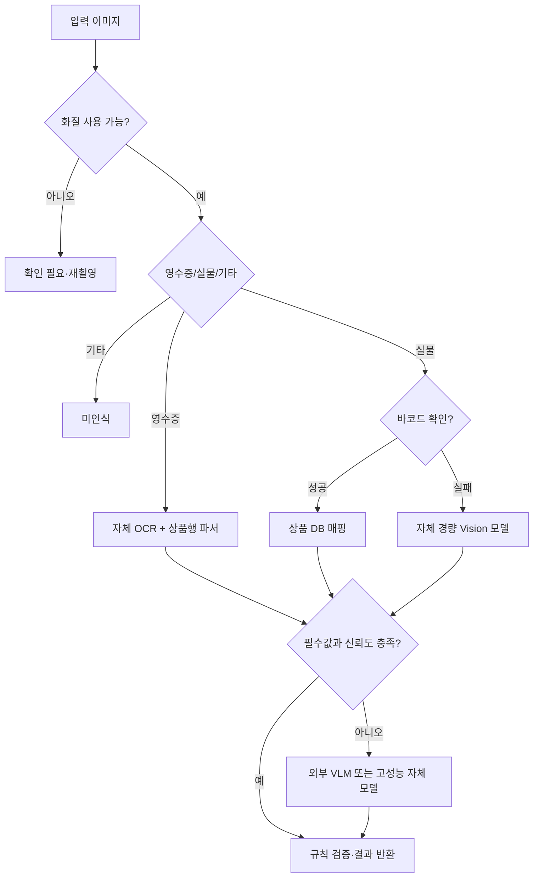

# 오조사마의 AI 설계 Wiki

스마트 냉장고 서비스의 AI는 사용자가 촬영한 영수증·식재료 사진을 냉장고 재고로 바꾸고, 보유 재료와 소비기한을 근거로 실제로 만들기 쉬운 레시피를 추천합니다.

이 문서는 AI 기능을 외부 API 하나에 종속시키지 않고, 자체 모델과 규칙 기반 처리를 점진적으로 발전시키기 위한 설계 문서의 진입점입니다.

## 단계별 설계 문서

1. [단계 1: 모델 API 설계](./단계-1-모델-API-설계.md)

## AI가 해결하는 두 가지 사용자 문제

### 식재료 자동 등록

- 입력 이미지가 영수증인지 실물 사진인지 구분합니다.
- 상품·식재료명, 수량, 소비기한 후보를 추출합니다.
- 포장에서 용량을 확인할 수 있으면 고체는 `g`, 액체는 `ml`로 표준화합니다.
- 서비스가 사용하는 고정 카테고리로 정규화합니다.
- 인식 근거와 불확실성을 바탕으로 `인식`, `미인식`, `확인 필요`, `AI 예상`을 결정합니다.
- 사용자가 수정한 내용을 평가 데이터로 축적하여 모델을 개선합니다.

### 냉장고 기반 레시피 추천

- 현재 보유한 재료를 최대한 많이 활용합니다.
- 소비기한이 가까운 재료에 가장 높은 우선순위를 줍니다.
- 알레르기와 비선호 재료는 추천 후보를 만들기 전에 제외합니다.
- 검증된 레시피 검색과 설명 가능한 랭킹을 우선하며, LLM은 검색 보완과 설명 생성에 제한적으로 사용합니다.

## 고정 카테고리

AI는 다음 목록 밖의 카테고리를 새로 생성하지 않습니다.

| 코드 | 표시 이름 |
| --- | --- |
| `VEGETABLE` | 채소 |
| `FRUIT` | 과일 |
| `MEAT` | 육류 |
| `SEAFOOD` | 수산 |
| `DAIRY` | 유제품 |
| `TOFU_BEAN` | 두부·콩류 |
| `GRAIN_NOODLE` | 곡류·면 |
| `PROCESSED_FOOD` | 가공식품 |
| `SEASONING` | 양념 |
| `BEVERAGE` | 음료 |
| `OTHER` | 기타 |

`OTHER`는 모델이 분류에 실패했을 때 사용하는 값이 아니라, 식재료는 식별했지만 앞선 열 개 카테고리에 속하지 않을 때만 사용합니다.

## 설계 원칙

- AI의 추정과 이미지에서 직접 확인한 사실을 구분합니다.
- 소비기한과 알레르기처럼 안전에 영향을 주는 값은 모델이 임의로 확정하지 않습니다.
- 외부 AI API는 초기 품질 확보와 어려운 사례의 보조 수단으로 사용합니다.
- OCR, 문서 분류, 카테고리 분류, 추천 랭킹은 자체 데이터와 모델로 계속 개선합니다.
- 모델이 실패해도 사용자는 직접 입력으로 냉장고 재고를 등록할 수 있어야 합니다.
- 모델 변경은 정확도, 지연시간, 비용을 같은 평가 세트에서 비교한 뒤 승인합니다.
- 수량과 용량을 구분하며, 용량을 확인할 수 없는 경우 임의로 생성하지 않습니다.

## 기준 모델 구성

| 역할 | 1차 선정 모델·기술 | 서비스 적용 방식 |
| --- | --- | --- |
| 이미지 품질·입력 유형 분류 | `MobileNetV3-Small` | CPU에서 영수증·실물·기타를 분류하고 흐림 등 품질 문제를 조기 탐지 |
| 한국어 OCR | `PP-OCRv5 Korean Mobile` | 영수증 상품행, 포장 상품명, 소비기한, 용량 문자 인식 |
| 어려운 이미지 해석 | `Qwen3-VL-4B-Instruct` | OCR·바코드·경량 모델이 해결하지 못한 요청의 구조화 추출 |
| 레시피·보관 지식 검색 | `BGE-M3` + 키워드 검색 | 한국어 의미 검색과 정확한 재료명 일치를 결합한 하이브리드 RAG |
| 레시피 순위 | 규칙 기반 랭커 → `LightGBM LambdaMART` | 초기에는 임박도·재료 활용률로 계산하고 사용자 행동이 쌓이면 학습 랭커로 발전 |
| 추천 설명 | 템플릿 우선, 필요 시 소형 LLM | 추천 근거를 짧게 설명하며 레시피 원문을 새로 생성하지 않음 |

선정 근거와 튜닝·최적화·교체 기준은 [단계 2: 모델 추론 성능 최적화](./단계-2-모델-추론-성능-최적화.md)에 정리합니다.

## 용량 표준화 원칙

- 개수는 `quantity`, 한 개당 용량은 `capacity`로 분리합니다.
- 고체·분말·면·육류·채소 등 중량 기반 식품은 `g`로 저장합니다.
- 물·우유·음료·액상 양념 등 부피 기반 식품은 `ml`로 저장합니다.
- 이미지에서 `kg`를 읽으면 `g`, `L`를 읽으면 `ml`로 환산합니다.
- `1 kg = 1,000 g`, `1 L = 1,000 ml`의 단순 단위 환산만 자동 적용합니다.
- 고체의 부피를 중량으로 바꾸거나 액체의 중량을 부피로 바꾸는 밀도 환산은 자동 적용하지 않습니다.
- `2개입 500g`은 수량 `2`, 총용량 `500g`으로 저장하고 한 개당 `250g`이라고 임의 추정하지 않습니다.
- 숫자, 단위, 총용량·개별용량 여부가 불명확하면 `확인 필요`로 처리합니다.

## 전체 흐름도

