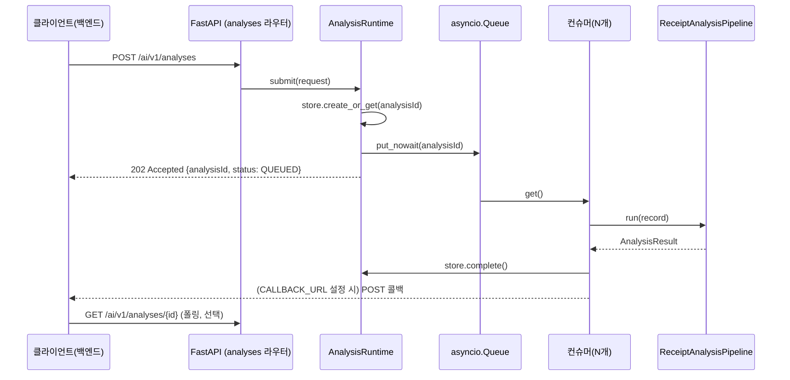

# 아키텍처

이 문서는 코드가 실제로 하는 일을 기준으로 쓴다.

## 한눈에 보기

- 단일 FastAPI 프로세스(`uvicorn --workers 1`)가 모든 걸 담당한다. 큐·분석 상태·결과는
  프로세스 메모리에만 있고([app/store.py](../app/store.py)), 재시작하면 사라진다.
- PostgreSQL(`receipt_ai` 스키마)은 상품 카탈로그·소비기한 규칙 같은 **보조 참조 데이터**만
  갖는다. 분석 이력·아이템은 이번 범위에서는 별도로 영속화하지 않는다 — 자세한 내용은
  [database.md](./database.md).
- 이미지 바이너리는 저장하지 않는다. `objectKey` + `sha256`만 받아 로컬 디스크 또는 S3에서
  읽고 해시를 검증한다.

## 요청 흐름



같은 `requestId`로 다시 요청하면 새로 큐에 넣지 않고 기존 `analysisId`를 그대로 반환한다
(멱등). 같은 `requestId`에 다른 이미지·조건을 보내면 `409 IDEMPOTENCY_CONFLICT`.

## 파이프라인 단계 ([app/pipeline.py](../app/pipeline.py))

`ReceiptAnalysisPipeline.run()`이 순서대로 실행한다:

1. **이미지 로드** — `ImageLoader`(로컬 또는 S3)가 `objectKey`를 읽고, 요청에 담긴 `sha256`과
   실제 파일 해시가 다르면 분석하지 않는다.
2. **OCR** — `PaddleTextExtractor.extract()`(PP-OCRv5 Korean)가 줄 단위 텍스트·좌표·신뢰도를
   반환한다. 엔진은 프로세스 안에 하나만 두고 `asyncio.Lock`으로 항상 한 번에 하나씩만
   돌린다 — [동시성과 메모리 관리](#동시성과-메모리-관리) 참고.
3. **문서 유형 판정** — `receipt_likelihood()`([app/domain/receipt_rules.py](../app/domain/receipt_rules.py))가
   OCR 결과 안의 키워드("합계"/"금액"/"카드" 등), 가격 패턴(`1,000` 형식 숫자), 날짜 패턴
   개수로 0~1 점수를 매긴다. **학습된 이미지 분류 모델이 아니라 규칙 기반 휴리스틱이다.**
   점수가 낮으면 `documentType=OTHER`, 빈 `items`로 즉시 끝낸다.
4. **상품행 복원** — `build_receipt_product_rows()`가 좌표를 보고 상품명·수량·금액을 한 행으로
   묶는다. 상품번호가 있는 영수증(번호형)과 없는 영수증(이름형, 같은 줄에 수량·금액이 동시에
   있는 텍스트만 인정) 두 전략을 순서대로 시도한다.
5. **행별 카테고리 확정** — 각 후보 줄에 대해 순서대로 확인한다:
   1. `known_food_category()` — 정규식 기반 상비 키워드 목록. 맞으면 `source=BUSINESS_RULE`.
   2. DB 상품 카탈로그(`product_catalog_lookup`) — 정확 일치면 `source=CATALOG`, 정확
      일치가 없고 `pg_trgm` 유사도가 임계값을 넘으면 `source=CATALOG_FUZZY`(신뢰도는 유사도
      값을 그대로 쓰고 `NEEDS_REVIEW` 사유를 붙인다). `DATABASE_URL`이 비어 있으면 이 단계는
      건너뛴다.
   3. 위 두 단계로도 못 정하면, 그 줄들만 모아 `OllamaFoodClassifier.classify()`(로컬 Ollama
      `gemma4:e2b`)에 보낸다. `source=MODEL_INFERENCE`. 모델이 OCR에 없던 줄·상품을
      만들어내면 원문 대조에서 걸러낸다.
6. **검증·표준화** — 수량/용량 파싱(고체는 g, 액체는 ml), 소비기한 추정(`shelf_life_lookup`,
   영수증에 날짜가 없을 때만 조회), `displayStatus` 결정. **현재 모든 식품 후보는
   `NEEDS_REVIEW`다** — 품질이 아직 승인되지 않았다는 정책을 유지한다.
7. **완료** — 결과를 `store.complete()`에 저장하고, `CALLBACK_URL`이 설정돼 있으면 백엔드로
   POST 콜백을 보낸다. 없으면 클라이언트가 GET으로 폴링한다.

## 동시성과 메모리 관리

- **큐**: `AnalysisRuntime`([app/runtime.py](../app/runtime.py))이 `asyncio.Queue`(기본 용량
  40, `ANALYSIS_QUEUE_MAXSIZE`)를 갖는다. 가득 차면 `429 AI_QUEUE_FULL`(재시도 가능)을
  반환한다. 큐 항목은 이미지 바이트 없이 `analysisId`만 들고 있어 가볍다.
- **컨슈머**: 기본 2개(`ANALYSIS_CONSUMER_COUNT`)가 같은 큐를 나눠 처리한다. 1개였을 때
  실측 결과 대기 중인 요청의 큐 대기시간이 처리시간(약 13초)의 **10배 가까이**(최대 127초)
  걸렸다 — 컨슈머를 늘려 이 대기시간을 줄였다. 다만 이 EC2가 4코어이고 Ollama도 GPU 없이
  CPU로 추론하므로, 3개로 늘리면 오히려 건당 처리시간이 3~6배 느려졌다(CPU 경합). 2개가
  이 인스턴스 사양에서 실측으로 확인한 최적점이다 — 코어를 늘리기 전까지는 이 값을 더
  올리지 않는 게 좋다.
- **OCR 엔진 잠금**: 컨슈머가 여러 개라도 `PaddleTextExtractor`의 `asyncio.Lock`이 OCR
  추론 자체는 항상 1개씩만 실행되게 막는다. 컨슈머 확장으로 겹치는 건 OCR 앞뒤(이미지
  로드, Gemma 호출 대기, DB 조회)뿐이다.
- **OCR 엔진 메모리 리사이클**: onnxruntime(HPI) 백엔드는 처리하는 이미지 크기가 바뀔
  때마다 내부 메모리 아레나가 커지고 줄지 않는다. 실측으로 EC2 프로세스가 OOM killer에
  강제 종료된 적이 있다(12.3GB까지 성장). `PaddleTextExtractor`는 요청
  `PADDLE_ENGINE_RECYCLE_AFTER`(기본 25)건마다, 또는 RSS가
  `PADDLE_ENGINE_RECYCLE_RSS_MB`(기본 6000MB)를 넘으면 — 둘 중 먼저 도달하는 조건으로 —
  엔진 객체를 버리고 `gc.collect()` + `malloc_trim(0)`으로 메모리를 회수한 뒤 다음 요청에서
  새로 만든다. 실측: 6.6GB → 522MB로 회수, 서비스 중단 없음. 프로세스 재시작이 아니라
  OCR 엔진만 교체하므로 큐·연결은 그대로 유지된다.
- **운영 주의**: `uvicorn --workers 1`을 반드시 유지해야 한다. worker를 여러 개 띄우면
  프로세스마다 별도의 큐·store를 가지게 되어 같은 `analysisId` 조회가 worker에 따라 다른
  결과를 낼 수 있다.

## 데이터 계약 ([app/schemas.py](../app/schemas.py))

### `Category` — 상품 카테고리 (AI가 이 목록 밖의 값을 새로 만들지 않는다)

| 값 | 의미 |
| --- | --- |
| `VEGETABLE` | 채소 |
| `FRUIT` | 과일 |
| `MEAT` | 육류 |
| `SEAFOOD` | 수산 |
| `DAIRY` | 유제품 |
| `TOFU_BEAN` | 두부·콩류 |
| `GRAIN_NOODLE` | 곡류·면 |
| `PROCESSED` | 가공식품 |
| `SEASONING` | 양념 |
| `BEVERAGE` | 음료 |
| `ETC` | 기타(식재료는 맞지만 위 10개 어디에도 속하지 않을 때만) |

### `Source` — 카테고리·값을 어떻게 정했는지

| 값 | 의미 |
| --- | --- |
| `BUSINESS_RULE` | 정규식 상비 키워드(`known_food_category()`) |
| `CATALOG` | DB 상품 카탈로그 정확 일치 |
| `CATALOG_FUZZY` | DB `pg_trgm` 유사도 폴백(정확 일치 실패 시만) |
| `MODEL_INFERENCE` | Gemma가 판별 |
| `KNOWLEDGE_ESTIMATE` | 소비기한을 `shelf_life_rules`로 추정 |
| `USER_CONFIRMED` | 사용자가 직접 확정(현재 파이프라인에서는 생성하지 않음) |
| `OCR` / `RECEIPT_LINE` | OCR 원문 그대로 |

### `DisplayStatus`

`RECOGNIZED` · `UNRECOGNIZED` · `NEEDS_REVIEW` · `AI_ESTIMATED`. 현재는 품질 승인 전이라
식품 후보가 전부 `NEEDS_REVIEW`로 나간다.

### `documentType.value`

`RECEIPT` 또는 `OTHER` 둘 중 하나다(`Literal["RECEIPT", "OTHER"]`).

## 프로젝트 구조

```text
app/
├─ adapters/
│  ├─ callback.py         # 백엔드 완료 콜백 (httpx.AsyncClient 재사용)
│  ├─ image_loader.py     # 로컬/S3 이미지 로드와 SHA-256 검증
│  ├─ ocr.py               # PP-OCRv5 어댑터 + 엔진 잠금·메모리 리사이클
│  ├─ ollama.py           # Gemma 상품행 판별 어댑터
│  ├─ product_catalog.py  # product_knowledge/product_aliases 조회(정확+유사도)
│  ├─ shelf_life.py       # shelf_life_rules 조회(부분 문자열 매칭)
│  └─ _cache.py           # LazyPool, BoundedAsyncCache(두 DB 조회가 공유)
├─ domain/
│  ├─ models.py           # 포트(인터페이스)와 도메인 타입
│  └─ receipt_rules.py    # 마스킹·행 복원·단위·날짜 규칙, receipt_likelihood()
├─ routers/
│  ├─ analyses.py         # 분석 접수·결과 조회 API
│  ├─ health.py           # liveness·readiness
│  └─ status.py           # 모델·큐·컨슈머 상태 API
├─ config.py               # 환경변수 설정(pydantic-settings)
├─ dependencies.py         # 인증·runtime·설정 의존성 주입
├─ error_handlers.py       # 공통 API 예외 응답
├─ logging/                # 비동기 UTC 날짜별 로그 + 요청·응답 audit 로그
├─ main.py                 # 앱 조립(build_runtime, create_app)과 lifespan
├─ pipeline.py             # 영수증 분석 단계 orchestration
├─ runtime.py               # 인메모리 큐 + 다중 컨슈머
├─ schemas.py               # 요청·응답 계약, enum
└─ store.py                 # 인메모리 상태·결과 저장소(TTL·최대개수로 제한)
```

## API

| Method | Endpoint | 역할 |
| --- | --- | --- |
| `POST` | `/ai/v1/analyses` | 영수증 분석 접수, `202 Accepted` |
| `GET` | `/ai/v1/analyses/{analysisId}` | 작업 상태와 결과 확인 |
| `GET` | `/ai/v1/models/status` | OCR·Ollama 준비 상태, 큐 크기·용량, 동시 처리 수(`activeCount`) |
| `GET` | `/health/live` | 프로세스 생존 확인 |
| `GET` | `/health/ready` | 모델 포함 준비 상태 확인 |

`inputHint=PRODUCT`(실물 이미지)는 아직 범위 밖이라 `400 INVALID_REQUEST`를 반환한다.

## 로깅

`analysisId`/`requestId` 기준으로 `queued → dequeued → image_load → ocr → document_checked
→ classification(+fallback) → validation → completed/failed → callback` 순서를 추적한다.
이미지 bytes, OCR 원문, 상세 식재료명은 일반 로그에 남기지 않는다. 모든 HTTP 요청·응답은
`X-Request-ID`(없으면 서버가 생성한 `traceId`) 기준으로 감사 로그 두 줄을 남긴다.
