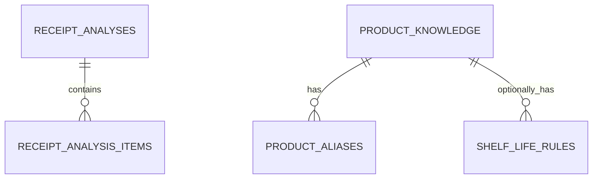

# PostgreSQL 스키마 (`receipt_ai`)

## 책임 범위

이 스키마는 영수증 AI의 **보조 참조 데이터**만 관리한다. 백엔드 MySQL의 `ingredients`가
사용자 냉장고 재고의 원본이며, PostgreSQL의 `product_knowledge`는 재고나 재료 마스터가
아니다. 레시피 관련 테이블은 이번 범위에서 제외했다. 분석 요청·결과는 현재 DB에 영속화하지
않는다(프로세스 메모리) — 자세한 내용은 [architecture.md](./architecture.md).

마이그레이션은 목적별로 분리되어 있다.

| 마이그레이션 | 테이블 | 역할 | 원본 여부 |
| --- | --- | --- | --- |
| `001_shelf_life_and_product_knowledge.sql` | `product_knowledge` | 상품 정규화·카테고리 분류 보조 자료 | 보조 자료 |
| | `product_aliases` | OCR 오인식·축약 상품명 별칭 | 보조 자료 |
| | `shelf_life_rules` | 출처가 검수된 관리용 소비기한 추정 규칙 | 보조 자료 |
| `002_receipt_analysis_history.sql` | `receipt_analyses` | 분석 요청, 상태, 모델 버전, 최종 응답 스냅샷 | AI 분석 원본 |
| | `receipt_analysis_items` | 영수증별 상품명·카테고리·수량·중량·소비기한 결과 | AI 분석 원본 |
| `003_product_catalog_seed.sql` | (INSERT만) | `product_knowledge` 초기 시드 31건 | 시드 데이터 |
| `004_catalog_fuzzy_source.sql` | (제약 변경만) | `receipt_analysis_items.category_source`에 `CATALOG_FUZZY` 허용 | 스키마 변경 |
| `005_product_catalog_seed_2.sql` | (INSERT만) | `product_knowledge` 2차 시드 3건(무/깻잎/브로콜리, "양파"는 003에 이미 있음) | 시드 데이터 |
| `006_product_catalog_seed_public.sql` | (INSERT만) | `product_knowledge` 대량 시드 238,800건(식품안전나라 공개 가공식품 DB) | 시드 데이터 |
| `007_deactivate_public_dataset_category_conflicts.sql` | (UPDATE만) | 006 시드 중 카테고리를 신뢰할 수 없는 763건 비활성화(`is_active=false`) | 데이터 정정 |



## 저장하지 않는 데이터

- 이미지 바이너리: 객체 저장소에 두고 검증된 `object_key`와 SHA-256만 저장한다.
- 사용자 냉장고·재고: 백엔드 MySQL이 관리한다.
- 영수증 수량의 상품 기본값: 수량은 현재 영수증에서 매번 읽는다.
- 사용자·관리자 교정 피드백: 동의·보관 정책 승인 전까지는 테이블 자체를 만들지 않는다.
- 단계별 지연시간·토큰 관측: Phoenix/OpenTelemetry와 역할이 겹치므로 어느 쪽을 쓸지 정하기
  전까지는 테이블을 만들지 않는다.
- 작업 큐: 큐는 FastAPI 프로세스 메모리에 있고 DB 상태 행을 작업 선점 용도로 사용하지 않는다.

## 조회 순서

1. 바코드가 있으면 `product_knowledge.barcode`를 정확히 조회한다.
2. 정규화한 OCR 문자열로 `product_aliases.normalized_alias`를 정확히 조회한다.
3. 정확한 값이 없으면 `pg_trgm` 유사도 조회로 후보만 만든다.
4. 후보가 확정 기준을 넘지 못하면 해당 행만 Gemma에 전달한다.
5. 영수증에서 소비기한이 확인되지 않은 경우에만 검수된 `shelf_life_rules`를 조회한다.

유사도 검색 결과는 자동 확정값이 아니라 모델 입력 후보이다. 임계값은 평가 데이터로 정한 뒤
애플리케이션 설정에 둔다.

**현재 연동 상태**: 5번(소비기한 미확인 시 `shelf_life_rules` 조회)에 이어 **2번(별칭·표준명
정확 일치)**과 **3번(`pg_trgm` 유사도, 정확 일치 실패 시 폴백)**도 앱에 연결했다
([app/adapters/product_catalog.py](../app/adapters/product_catalog.py)의
`PostgresProductCatalogLookup`). `DATABASE_URL`이 비어 있으면 두 조회 모두 자동으로
비활성화된다.

- **1번(바코드)**: 파이프라인이 바코드를 별도 필드로 추출하지 않아 이번 범위에서 제외했다.
- **2번(별칭·표준명)**: 구현함. `product_aliases.normalized_alias` 정확 일치를
  `product_knowledge.normalized_name` 정확 일치보다 우선하고, 하나의 쿼리(`UNION ALL` +
  `ORDER BY priority`)로 처리한다.
- **3번(`pg_trgm` 유사도)**: 구현함, 단 정확 일치가 실패했을 때만 쓰는 폴백이다.
  `product_knowledge.normalized_name`에 대해서만 `similarity() > settings.catalog_fuzzy_similarity_threshold`
  (기본 0.4)로 후보를 찾고 유사도 내림차순 1건만 쓴다. `product_aliases`는 아직 0건이라
  유사도 대상에서 뺐다(비어 있는 테이블을 UNION해도 의미 없음) — 별칭이 쌓이면 그때
  포함한다. 매칭되면 `category.source = "CATALOG_FUZZY"`로 정확 일치(`CATALOG`)와
  구분되고, 신뢰도를 유사도 값으로 낮추고 `reviewReasons`에 "유사한 상품명을 기준으로
  추정했다"는 사유를 추가한다 — 정확 일치와 같은 신뢰도로 자동 확정하지 않는다.
- **4번(Gemma에 카탈로그 근거 전달)**: 제외했다. 지금은 "카탈로그가 확정 → Gemma 건너뜀"
  또는 "카탈로그도 못 찾음 → 기존처럼 원문만 Gemma에" 두 가지뿐이고, 카탈로그 후보를
  Gemma 프롬프트에 힌트로 얹는 것은 하지 않는다.

파이프라인에서는 `known_food_category()`(정규식) → `product_catalog_lookup.find()`(DB,
정확 일치 → 유사도 폴백) → Gemma 순서로 확인한다. DB 카탈로그로 확정된 항목은
`category.source = "CATALOG"`(정확 일치) 또는 `"CATALOG_FUZZY"`(유사도 폴백)로 표시되어
정규식 매칭(`BUSINESS_RULE`)과 구분된다.

임계값 0.4는 실제 OCR 오차 사례("예거라틀러레몬" vs 시드에 넣은 "예거라들러레몬", 글자 하나
차이)로 `similarity()`를 직접 측정해 정했다 — 해당 쌍은 0.4545, 무관한 단어 쌍은 0으로
명확히 갈렸다. 데이터가 늘면 재측정이 필요할 수 있다.

추정된 소비기한은 `ExpirationValue.estimatedRange`(from/to)로 반환되며
`dateType=ESTIMATED_CONSUMPTION_WINDOW`, `source=KNOWLEDGE_ESTIMATE`로 표시된다.
`displayStatus`는 이 경우에도 `NEEDS_REVIEW`를 유지한다.

## `shelf_life_rules` 시드 데이터

`shelf_life_rules`는 스키마만으로는 비어 있어 아무 추정도 하지 못한다.
[database/seed_shelf_life_seed.py](../database/seed_shelf_life_seed.py)가 실시간
웹검색/LLM이 아니라 **USDA FSIS FoodKeeper 공개 데이터**
([data.gov 카탈로그](https://catalog.data.gov/dataset/fsis-foodkeeper-data))에서 한국
영수증에 자주 등장하는 29개 식재료의 보관기간을 뽑아
`database/seed_data/shelf_life_rules_seed.sql`을 생성한다. 소비기한처럼 안전에 영향을 주는
값은 모델이 임의로 확정하지 않는다는 원칙에 따라 실시간 생성값이 아닌 정부 공개 자료만
사용했다.

- 원본 데이터: `database/seed_data/foodkeeper_ingredients_raw.csv` (GitHub 미러
  https://github.com/jelera/food-shelflife-db 에서 원본 그대로 내려받음, FSIS 공식 서버는
  자동화 요청을 차단함)
- 매핑 규칙: `app/domain/receipt_rules.py`의 `storage_for_category()`가 `MEAT`/`SEAFOOD`는
  항상 `FROZEN`, 그 외는 항상 `REFRIGERATED`로만 조회하므로, 각 식재료는 실제로 조회될
  `storage_type` 한 가지만 채웠다(반대쪽은 조회되지 않으므로 시드하지 않음).
- 전부 `package_state='UNOPENED'`, `reference_date_type='PURCHASE_DATE'`만 사용한다 —
  파이프라인이 아직 "개봉일"을 별도로 추적하지 않아 `Refrigerate_After_Opening` 계열 값은
  정확히 계산할 수 없으므로 제외했다.
- 재생성하려면: `python3 database/seed_shelf_life_seed.py` (raw CSV만 읽고 DB에는 아무것도
  쓰지 않음)
- 실제 적용: 생성된 `.sql`을 검토한 뒤 직접 실행한다.
  ```bash
  psql "$DATABASE_URL" -v ON_ERROR_STOP=1 -f database/seed_data/shelf_life_rules_seed.sql
  ```

**브랜드 무관 매칭**: `normalize_product_name()`은 "서울우유"처럼 브랜드명을 지우지 않으므로,
[app/adapters/shelf_life.py](../app/adapters/shelf_life.py)의 조회는 정확히 일치(`=`)가
아니라 **부분 문자열 포함**(`strpos(정규화이름, shelf_life_rules.normalized_ingredient_name) > 0`)
으로 매칭한다. 즉 시드에 넣은 일반명 "우유"가 "서울우유", "매일우유" 같은 정규화 결과 안에
포함되어 있으면 매칭된다. 여러 규칙이 동시에 포함 관계를 만족하면 더 긴(구체적인)
`normalized_ingredient_name`을 우선한다.

이 방식은 `shelf_life_rules`처럼 **항목 수가 적고 이름이 짧은 일반명 테이블**에서만 적합하다.
항목이 많아지거나 이름이 다른 단어의 부분 문자열이 되는 경우가 늘면, `product_aliases`처럼
별도 별칭 테이블 + `pg_trgm` 유사도 조회로 옮겨야 한다. `product_knowledge`/`product_aliases`는
부분 문자열이 아니라 **정확 일치**만 쓰므로 이 오탐 위험이 없다.

## `product_knowledge` 시드 데이터

[database/migrations/003_product_catalog_seed.sql](../database/migrations/003_product_catalog_seed.sql)에
31건이 들어있다. 앞의 29건은 `shelf_life_rules`와 같은 명확한 식재료 일반명 목록을
재사용했고, 뒤의 2건("마늘빅프랑크", "예거라들러레몬")은 실제 GS25 영수증 벤치마크로 확인한
OCR 원문이다. 카테고리를 확신할 수 없었던 "마운틴클래식/마운틴틀러스트"는 추측해서 넣지
않고 뺐다. 전부 `verification_status='MODEL_INFERRED'`로 표시했다(사람이 검수 화면에서
확인한 적 없음 — `known_food_category()` 정규식 규칙과 동일한 신뢰 수준).

`product_aliases`는 아직 비어 있다. 지금까지 관찰한 OCR 원문이 전부 표준명 자체와 같아서
(예: "마늘빅프랑크"가 그대로 상품명), 별칭이 필요한 실제 사례를 아직 못 봤다 — 근거 없이
별칭 변형을 지어내 넣지 않는다.

[database/migrations/005_product_catalog_seed_2.sql](../database/migrations/005_product_catalog_seed_2.sql)에
2차로 3건("무", "깻잎", "브로콜리")을 더했다("양파"도 같은 원인으로 놓쳤지만 003에 이미
있었다). 영수증2.jpg를 실제로 돌려보니 Gemma가 이 4개(양파 포함)를 5개 미해결 줄 중 전부
(0/5) 놓쳤는데, 원인은 두 가지였다 — (1) 상품번호 뒤에 붙는 단일문자 코드("P"=포인트적립
등)가 상품명과 공백 없이 붙어 있어 Gemma·정규식 둘 다 못 알아봤다(코드 제거는 시드가 아니라
[app/domain/receipt_rules.py](../app/domain/receipt_rules.py)의 `_strip_product_type_code()`로
고쳤다), (2) 코드를 뗀 뒤에도 이 4개는 `known_food_category()` 정규식 목록에 아예 없던
일반 채소명이었다. "무"는 한 글자라 정규식 substring 매칭으로 넣으면 "무료"/"무이자" 같은
무관한 단어와 오탐할 위험이 커서 정확 일치만 쓰는 `product_knowledge`에 넣었고, 나머지
2건도 일관성을 위해 같이 넣었다. "브로콜리"는 OCR이 "브로커리"로 오인식했는데, 정확 일치는
실패하지만 위 `pg_trgm` 유사도 폴백이 잡아준다.

### 대량 시드(공개 데이터셋)

003/005는 실제 영수증 테스트로 발견한 항목만 하나씩 손으로 넣은 것이지만,
[database/migrations/006_product_catalog_seed_public.sql](../database/migrations/006_product_catalog_seed_public.sql)은
**식품안전나라 K-FIND 가공식품 DB**(공개 데이터셋, 로그인 없이 간단한 활용정보 설문만
쓰면 받을 수 있음 — https://various.foodsafetykorea.go.kr/nutrient/ > 영양성분 DB
내려받기 > 가공식품 DB)에서 238,800건을 한 번에 넣었다.

- [database/seed_product_catalog_public.py](../database/seed_product_catalog_public.py)가
  원본 엑셀(31만여 행, 약 200MB — 용량 문제로 저장소엔 커밋하지 않는다)을 읽어
  `database/seed_data/product_catalog_public_seed.csv`(마찬가지로 51MB라 `.gitignore`
  대상)를 생성한다. `python-calamine`(Rust 기반 xlsx 파서)이 필요하다 — openpyxl은 이
  크기에서 감당이 안 될 만큼 느렸다.
- 식품대분류명(및 "절임류 또는 조림류"는 식품중분류명까지)으로 카테고리를 **한 갈래로
  확신할 수 있는 것만** 골랐다. "농산가공식품류"(견과류·밀가루·전분 등이 뒤섞여 있음),
  "조림류"(멸치조림/고기조림 등 재료가 다양함), "특수영양식품", "알가공품류" 같은 대분류
  (전체의 약 12.6%, 3.4만여 건)는 근거 없이 카테고리를 추측해 넣지 않는다는 원칙에 따라
  제외했다.
- 정규화명이 기존 003/005의 34건과 겹치는 항목(17건)은 `ON CONFLICT ... DO NOTHING`으로
  기존 행을 덮어쓰지 않고 건너뛴다.
- 적용 시 `\copy`는 psql 클라이언트가 실행하는 파일 시스템을 기준으로 하므로,
  `sudo -u postgres psql`처럼 다른 유저로 실행하면 그 유저가 CSV 파일을 읽을 권한이
  있어야 한다(예: EC2에서 `ec2-user` 홈 디렉터리는 700 권한이라 `postgres` 유저가 못
  들어간다 — `/tmp`처럼 다른 유저도 읽을 수 있는 경로에 같은 상대경로 구조로 복사한 뒤 그
  디렉터리에서 실행해야 한다).
- **알려진 트레이드오프**: 데이터가 많아질수록 `pg_trgm` 유사도 폴백이 의도하지 않은
  후보와 우연히 더 비슷하게 매칭될 위험이 커진다. 예를 들어 OCR 오타 "브로커리"(의도:
  "브로콜리")가 이 대량 데이터셋의 실제 상품 "브로커리팩"과 문자열이 더 비슷해(유사도
  0.57 vs 브로콜리와는 정확 불일치) 카테고리가 VEGETABLE 대신 PROCESSED로 잘못 매칭된
  사례를 실제로 확인했다. `category.source = "CATALOG_FUZZY"`로 구분 표시되고
  `displayStatus`도 항상 `NEEDS_REVIEW`라 최종 확정 전 사용자 확인을 거치므로 잘못된 값이
  그대로 굳어지지는 않지만, 데이터가 늘수록 이런 사례가 더 나올 수 있다는 점은 감안해야
  한다.

### 카테고리 정정(006 데이터 정제)

웹에서 가져온 실제 영수증 이미지 113장으로 대량 시드를 스트레스 테스트하다가, **정확
일치(`CATALOG`, fuzzy 아님)인데도 카테고리가 틀린 사례**를 발견했다 — "수박"이 PROCESSED로
매칭됐다.
[database/migrations/007_deactivate_public_dataset_category_conflicts.sql](../database/migrations/007_deactivate_public_dataset_category_conflicts.sql)이
이런 006 시드 763건을 `is_active=false`로 비활성화한다(삭제가 아님 — 원본 근거를 남기고
복구 가능하게 함). 추측이 아니라 원본 데이터에서 기계적으로 도출한 두 가지 근거만 썼다.

1. **정규화명 충돌(745건)**: 원본 엑셀 안에서 같은 정규화명이 서로 다른 대분류(카테고리)로
   동시에 등장하는 경우. 예: "갈비탕"은 MEAT 15건·PROCESSED 19건으로 원본 데이터 자체가
   합의를 못 한다. 006의 dedup 로직(`seen.setdefault()`)은 먼저 나온 행을 그냥
   채택했는데, 이는 사실상 엑셀 내 등장 순서로 정해진 것과 같다.
2. **흔한 생과일·생채소 원물명(96건, 위와 중복 제외)**: "수박"은 원본 데이터에서 카테고리가
   하나로만 나오지만(=위 745건에는 안 잡힘), 그 하나가 구조적으로 틀렸다. 식품안전나라
   "가공식품 DB"는 애초에 생과일·생채소를 다루지 않는 가공식품 전용 데이터셋이라, "수박"
   이라는 이름의 가공식품(수박맛 빙과류 등)이 우연히 하나 있으면 그게 실제 생수박의
   정규화명과 충돌한다. 흔한 생과일·채소 98개를 손으로 검증해 31개가 이 문제였다(2개는
   우연히 정상이라 제외 — 깐마늘, 죽순).

`database/seed_data/public_dataset_category_exclusions.csv`(831개 정규화명)가 두 목록의
합집합이다 — 로컬에 남아있던 원본 엑셀(31만 행)을 다시 읽어 생성했다. 검증하지 않은 이름도
안전하게 포함했다(DB에 없으면 그냥 no-op).

## 캐싱과 동시성

[app/adapters/shelf_life.py](../app/adapters/shelf_life.py),
[app/adapters/product_catalog.py](../app/adapters/product_catalog.py) 둘 다
[app/adapters/_cache.py](../app/adapters/_cache.py)의 `LazyPool`(연결 pool을
`asyncio.Lock`으로 한 번만 생성), `BoundedAsyncCache`(조회 결과를 없음 포함 LRU로 캐싱,
`settings.reference_cache_max_size` 기본 2000건)를 공유해서 쓴다. 두 조회 다 DB 조회 실패
시 예외를 잡아 로그만 남기고 `None`을 반환하도록 `app/pipeline.py`에서 감싸져 있다 —
참조 테이블 조회 하나가 실패했다고 전체 분석이 `FAILED`로 떨어지지 않는다.


## 보관기간과 정리 작업

`receipt_analyses.purge_after`는 `trg_receipt_analyses_default_purge_after` 트리거가
INSERT 시 `submitted_at + 90일`로 자동 채운다. **90일은 팀이 확정한 분석 결과 보관기간
정책값**이다. 애플리케이션이 INSERT 시 `purge_after`를 직접 지정하면 트리거는 그 값을
덮어쓰지 않는다.

실제 삭제는 `receipt_ai.purge_expired_analyses()` 함수가 수행하며, `purge_after`가 지난
분석을 무조건 지운다(`receipt_analysis_items`는 CASCADE로 함께 정리됨). 이 함수는
마이그레이션에 정의만 되어 있고 스스로 실행되지 않으므로, `pg_cron` 확장이나 외부
스케줄러(cron + `psql`)로 별도 등록해야 한다:

```sql
SELECT cron.schedule('purge-receipt-analyses', '0 * * * *',
  $$SELECT receipt_ai.purge_expired_analyses()$$);
```

`pg_cron`을 쓸 수 없는 관리형 DB라면 EC2 쪽 cron이
`psql -c "SELECT receipt_ai.purge_expired_analyses();"`를 주기 실행하도록 구성한다.

현재 `storageType`은 API와 백엔드 ERD를 따라 `REFRIGERATED`, `FROZEN`만 허용한다.

## 키와 인덱스 원칙

- 모든 독립 테이블의 내부 PK는 `BIGINT GENERATED ALWAYS AS IDENTITY`를 사용한다.
- API에 노출되는 `analysis_id`, `item_id`는 내부 PK와 분리하고 `UNIQUE` 제약으로 멱등성과
  조회 계약을 보장한다.
- PostgreSQL은 FK 열에 인덱스를 자동 생성하지 않으므로 삭제·조인에 사용하는 FK 인덱스를
  명시한다.
- 상태 조회, 정규화 이름, 바코드·별칭, 검수 대기 목록처럼 이미 확정된 접근 경로만 우선
  인덱싱한다.
- 추측성 복합 인덱스는 추가하지 않고 운영 쿼리의 `EXPLAIN (ANALYZE, BUFFERS)` 결과를 보고
  보완한다.
