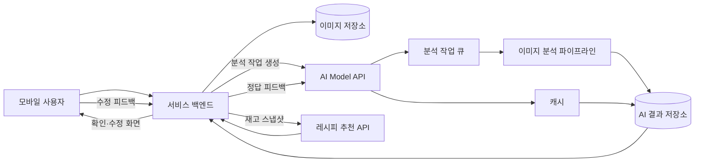

# 단계 1: 모델 API 설계

## 1. 이 설계가 우리 서비스에 필요한 이유

우리 서비스에서 사진 인식 결과는 단순한 이미지 설명이 아니라 냉장고 재고, 소비기한 알림, 레시피 추천의 입력 데이터가 됩니다. 이미지 분석 형식이 바뀔 때마다 백엔드와 프론트엔드도 함께 수정해야 한다면 모델 개선 속도가 느려지고, 잘못 읽은 날짜가 그대로 사용자 알림에 반영될 수 있습니다.

따라서 AI 모델을 하나의 독립된 내부 서비스로 두고 다음 계약을 고정합니다.

- 어떤 이미지가 들어왔는지 판별합니다.
- 이미지에서 직접 확인한 값과 AI가 추정한 값을 구분합니다.
- 제품 개수와 식품 용량을 분리하고, 확인된 용량은 `g` 또는 `ml`로 표준화합니다.
- 서비스가 처리할 수 있는 고정된 카테고리와 상태값만 반환합니다.
- 불확실한 결과는 사용자 확인 대상으로 전달합니다.
- 레시피 추천은 재고 검색, 안전 필터, 랭킹 근거를 함께 반환합니다.

이 계약을 지키면 OCR이나 VLM을 교체하더라도 앱은 같은 응답 형식을 사용할 수 있습니다. 외부 API 사용량을 줄이고 자체 모델로 전환할 때도 서비스 코드의 변경 범위를 최소화할 수 있습니다.

## 2. 서비스 내 역할



AI Model API는 외부 사용자에게 직접 공개하지 않습니다. 인증, 냉장고 소유권 확인, 요청량 제한은 서비스 백엔드가 담당하고 AI API는 내부 서비스 인증을 통과한 요청만 받습니다.

이미지 분석은 수 초가 걸리거나 재시도가 발생할 수 있으므로 비동기 작업으로 처리합니다. 사용자는 업로드 직후 `처리 중` 상태를 받고, 완료 후 결과 확인 화면으로 이동합니다.

## 3. 상태와 근거 설계

### 3.1 사용자 표시 상태

| API 값 | 사용자 표시 | 결정 기준 | 사용자 행동 |
| --- | --- | --- | --- |
| `RECOGNIZED` | 표시 없음 | 이미지에서 필수값을 직접 확인했고 검증 규칙을 통과함 | 결과를 그대로 등록하거나 수정 |
| `UNRECOGNIZED` | 미인식 | 입력 유형 또는 식재료를 식별할 근거를 찾지 못함 | 다시 촬영하거나 직접 입력 |
| `NEEDS_REVIEW` | 확인 필요 | 일부 값 누락, 낮은 화질, 모델 간 충돌, 비정상 날짜 등으로 자동 확정할 수 없음 | 표시된 필드를 확인·수정 |
| `AI_ESTIMATED` | AI 예상 | 식재료는 식별했지만 날짜가 이미지에 없어 지식 검색으로 보관 가능 기간을 추정함 | 추정 근거를 보고 날짜 확정 또는 수정 |

### 3.2 상태 우선순위

한 항목에 여러 조건이 동시에 발생하면 다음 순서로 최종 상태를 결정합니다.

```text
UNRECOGNIZED > NEEDS_REVIEW > AI_ESTIMATED > RECOGNIZED
```

예를 들어 우유는 식별했지만 소비기한이 보이지 않고 이미지도 심하게 흐리다면 `AI_ESTIMATED`가 아니라 `NEEDS_REVIEW`를 반환합니다. 품질 문제를 감춘 채 추정값을 제공하지 않기 위함입니다.

### 3.3 필드별 출처

항목 전체 상태와 별개로 각 필드는 출처를 가집니다.

| 출처 | 의미 |
| --- | --- |
| `OCR` | 이미지의 문자 영역에서 직접 읽음 |
| `VISION` | 실물 형태 또는 패키지 특징으로 인식함 |
| `BARCODE` | 바코드와 상품 DB로 확인함 |
| `RECEIPT_LINE` | 영수증 상품 행에서 읽음 |
| `RAG_ESTIMATE` | 검증된 보관기간 지식에서 추정함 |
| `USER_CONFIRMED` | 사용자가 확인하거나 수정함 |

소비기한 알림은 `OCR`, `BARCODE`, `USER_CONFIRMED` 값을 우선합니다. `RAG_ESTIMATE`는 실제 표시 날짜가 아니며 화면에서도 반드시 `AI 예상`으로 구분합니다.

### 3.4 수량과 용량 규칙

| 필드 | 의미 | 예시 |
| --- | --- | --- |
| `quantity` | 제품 또는 묶음의 개수 | 우유 2팩이면 `2` |
| `capacity.value` | 확인된 용량의 숫자 | `500` |
| `capacity.unit` | 내부 표준 용량 단위 | `G` 또는 `ML` |
| `capacity.scope` | 총용량인지 개별용량인지 구분 | `TOTAL`, `PER_ITEM`, `UNKNOWN` |
| `capacity.source` | 용량을 확인한 근거 | `OCR`, `BARCODE`, `RECEIPT_LINE`, `USER_CONFIRMED` |

- `500g`, `1kg` 등 중량 표시는 각각 `500 G`, `1000 G`로 저장합니다.
- `500ml`, `1L` 등 부피 표시는 각각 `500 ML`, `1000 ML`로 저장합니다.
- 대소문자와 공백 차이는 정규화하지만 원문은 `evidenceText`에 보관합니다.
- 단위 없는 숫자를 용량으로 추정하지 않습니다.
- `kg ↔ g`, `L ↔ ml` 이외의 밀도 기반 환산은 하지 않습니다.
- `2개입 500g`처럼 총용량만 표시된 경우 `quantity=2`, `capacity.scope=TOTAL`로 저장합니다.
- 총용량과 개별용량을 구분하지 못하면 `capacity.scope=UNKNOWN` 및 `NEEDS_REVIEW`로 처리합니다.

## 4. 엔드포인트 목록

기본 경로는 `/ai/v1`이며, 모델 변경이 아니라 API 계약이 깨질 때만 버전을 올립니다.

| Method | Endpoint | 기능 |
| --- | --- | --- |
| `POST` | `/ai/v1/analyses` | 이미지 분석 작업 생성 |
| `GET` | `/ai/v1/analyses/{analysisId}` | 작업 상태와 분석 결과 조회 |
| `POST` | `/ai/v1/analyses/{analysisId}/feedback` | 사용자가 확정한 값을 모델 개선 데이터로 수집 |
| `POST` | `/ai/v1/recipe-recommendations` | 재고·취향·제약조건을 이용해 레시피 추천 |
| `GET` | `/ai/v1/models/status` | 배포 모델 버전과 서비스 준비 상태 확인 |

이미지는 AI API에 Base64로 직접 전달하지 않습니다. 서비스 백엔드가 접근 시간이 제한된 저장소 참조를 전달하여 요청 크기와 메모리 사용량을 줄입니다.

## 5. 이미지 분석 API 명세

### 5.1 분석 작업 생성

`POST /ai/v1/analyses`

#### 요청

```json
{
  "requestId": "req_01JEXAMPLE",
  "image": {
    "url": "s3://uploads/2026/08/31/image-001.webp",
    "sha256": "72d88f..."
  },
  "inputHint": "AUTO",
  "locale": "ko-KR",
  "timezone": "Asia/Seoul"
}
```

| 필드 | 필수 | 설명 |
| --- | --- | --- |
| `requestId` | Y | 중복 요청 방지를 위한 서비스 요청 ID |
| `image.url` | Y | 내부 S3저장소의 이미지 참조 |
| `image.sha256` | Y | 중복 분석 캐시와 무결성 확인 |
| `inputHint` | Y | `AUTO`, `RECEIPT`, `PRODUCT` 중 하나. 기본은 `AUTO` |
| `locale` | Y | OCR 언어 및 날짜 형식 해석에 사용 |
| `timezone` | Y | 날짜 검증 기준 시간대 |

#### 응답

```json
{
  "analysisId": "ana_01JEXAMPLE",
  "status": "QUEUED",
  "submittedAt": "2026-08-31T10:15:00+09:00",
  "pollAfterMs": 1000
}
```

성공 시 HTTP `202 Accepted`를 반환합니다.

### 5.2 분석 결과 조회

`GET /ai/v1/analyses/{analysisId}`

#### 성공 예시: 실물 사진

```json
{
  "analysisId": "ana_01JEXAMPLE",
  "status": "COMPLETED",
  "documentType": {"value": "PRODUCT", "confidence": 0.98},
  "imageQuality": {"score": 0.91, "issues": []},
  "items": [
    {
      "itemId": "item_001",
      "displayStatus": "RECOGNIZED",
      "name": {
        "value": "서울우유 나100%",
        "normalizedValue": "우유",
        "source": "VISION",
        "confidence": 0.94
      },
      "category": {"value": "DAIRY", "confidence": 0.99},
      "quantity": {"value": 1, "unit": "PACK", "confidence": 0.88},
      "capacity": {
        "value": 1000,
        "unit": "ML",
        "scope": "PER_ITEM",
        "source": "OCR",
        "confidence": 0.96,
        "evidenceText": "1 L"
      },
      "expiration": {
        "date": "2026-09-07",
        "dateType": "USE_BY",
        "source": "OCR",
        "confidence": 0.93,
        "evidenceText": "소비기한 26.09.07"
      },
      "reviewReasons": []
    }
  ],
  "modelTrace": {
    "pipelineVersion": "image-analysis-1.0.0",
    "classifierVersion": "doc-classifier-0.3.0",
    "extractorVersion": "food-vlm-0.2.0",
    "policyVersion": "confidence-policy-1.0.0"
  }
}
```

#### 성공 예시: 영수증과 AI 예상

```json
{
  "analysisId": "ana_02JEXAMPLE",
  "status": "COMPLETED",
  "documentType": {"value": "RECEIPT", "confidence": 0.97},
  "items": [
    {
      "itemId": "item_101",
      "displayStatus": "AI_ESTIMATED",
      "name": {
        "value": "친환경 애호박",
        "normalizedValue": "애호박",
        "source": "RECEIPT_LINE",
        "confidence": 0.92
      },
      "category": {"value": "VEGETABLE", "confidence": 0.98},
      "quantity": {"value": 1, "unit": "EA", "confidence": 0.76},
      "capacity": null,
      "expiration": {
        "date": null,
        "estimatedRange": {"from": "2026-09-03", "to": "2026-09-07"},
        "dateType": "ESTIMATED_CONSUMPTION_WINDOW",
        "source": "RAG_ESTIMATE",
        "confidence": 0.68,
        "assumptions": ["구매일 2026-08-31", "냉장 보관", "미절단 상태"],
        "evidenceIds": ["storage-guide-vegetable-014"]
      },
      "reviewReasons": ["표시된 소비기한이 없어 보관 조건을 기준으로 예상했습니다."]
    }
  ]
}
```

AI 예상은 단일 확정 날짜보다 기간으로 반환합니다. 사용자가 보관 방식과 개봉 여부를 확인하면 서비스 백엔드가 알림 기준일을 선택합니다.

## 6. 피드백 API 명세

`POST /ai/v1/analyses/{analysisId}/feedback`

```json
{
  "itemId": "item_101",
  "action": "CORRECTED",
  "confirmed": {
    "normalizedName": "애호박",
    "category": "VEGETABLE",
    "quantity": 2,
    "unit": "EA",
    "capacityValue": 500,
    "capacityUnit": "G",
    "capacityScope": "TOTAL",
    "expirationDate": "2026-09-05",
    "expirationSource": "USER_CONFIRMED"
  },
  "consentForModelImprovement": true
}
```

피드백은 원본 추론 결과를 덮어쓰지 않습니다. `모델 예측`, `사용자 확정값`, `수정 차이`를 별도로 보관해야 모델별 오류율을 계산하고 학습 데이터를 만들 수 있습니다.

## 7. 레시피 추천 API 명세

`POST /ai/v1/recipe-recommendations`

### 요청

```json
{
  "requestId": "req_recipe_001",
  "inventoryVersion": 42,
  "inventory": [
    {
      "ingredientId": "ing_tofu",
      "name": "두부",
      "quantity": 1,
      "unit": "PACK",
      "capacity": {"value": 300, "unit": "G", "scope": "PER_ITEM"},
      "expiresAt": "2026-09-01",
      "expirationSource": "OCR"
    },
    {
      "ingredientId": "ing_green_onion",
      "name": "대파",
      "quantity": 0.5,
      "unit": "EA",
      "capacity": null,
      "expiresAt": "2026-09-03",
      "expirationSource": "AI_ESTIMATED"
    }
  ],
  "preferences": {
    "allergens": ["PEANUT"],
    "dislikedIngredients": ["고수"],
    "preferredTags": ["한식", "매운맛 낮음"],
    "maxCookingMinutes": 30,
    "servings": 2
  },
  "limit": 5
}
```

### 응답

```json
{
  "recommendationId": "rec_01JEXAMPLE",
  "inventoryVersion": 42,
  "recommendations": [
    {
      "recipeId": "recipe_1024",
      "name": "두부 대파 조림",
      "score": 0.89,
      "scoreBreakdown": {
        "expiringIngredient": 0.35,
        "inventoryCoverage": 0.23,
        "preference": 0.18,
        "cookingTime": 0.08,
        "variety": 0.05
      },
      "usesInventory": ["두부", "대파"],
      "usesExpiringIngredients": ["두부"],
      "missingIngredients": ["진간장"],
      "allergenCheck": "PASSED",
      "reason": "내일 소비기한이 도래하는 두부를 모두 사용할 수 있고 추가 재료가 한 가지뿐입니다.",
      "source": {"type": "CURATED_RECIPE", "referenceId": "recipe_1024"}
    }
  ],
  "generatedAt": "2026-08-31T10:20:00+09:00"
}
```

레시피 원문과 조리법은 검증된 레시피 저장소에서 가져옵니다. LLM은 후보 검색을 보완하거나 추천 이유를 만드는 데 사용하고, 출처 없는 레시피를 최우선 결과로 확정하지 않습니다.

## 8. 오류 처리

| HTTP | 오류 코드 | 발생 조건 | 서비스 대응 |
| --- | --- | --- | --- |
| `400` | `INVALID_REQUEST` | 필수 필드 누락, 잘못된 날짜·카테고리 | 요청 수정 후 재전송 |
| `401` | `UNAUTHORIZED_SERVICE` | 내부 서비스 인증 실패 | 호출 차단 및 보안 로그 기록 |
| `404` | `ANALYSIS_NOT_FOUND` | 존재하지 않는 분석 ID | 사용자에게 재요청 안내 |
| `413` | `IMAGE_TOO_LARGE` | 크기·해상도 제한 초과 | 클라이언트 압축 또는 재촬영 |
| `415` | `UNSUPPORTED_IMAGE_TYPE` | 지원하지 않는 파일 형식 | JPEG·PNG·WebP로 변환 |
| `422` | `UNUSABLE_IMAGE` | 이미지가 너무 흐리거나 대상이 없음 | `미인식` 또는 재촬영 안내 |
| `429` | `RATE_LIMITED` | 사용자·서비스 한도 초과 | 대기 후 재시도 |
| `503` | `MODEL_UNAVAILABLE` | 자체 모델과 외부 대체 모델 모두 실패 | 직접 입력으로 전환 |

모든 재시도 가능한 응답에는 `retryable`과 `retryAfterMs`를 포함합니다. 동일한 `requestId`는 중복 작업을 만들지 않는 멱등성을 보장합니다.

## 9. 인증과 개인정보

- AI API는 사설 네트워크 또는 서비스 간 인증을 통해서만 호출합니다.
- 이미지 참조 URL은 짧은 만료시간을 사용하고 분석 워커에 최소 권한만 부여합니다.
- 영수증의 카드번호, 전화번호, 주소, 멤버십 번호는 OCR 후 즉시 마스킹합니다.
- 로그에는 원본 이미지, 인증 토큰, 전체 OCR 문자열을 남기지 않습니다.
- 모델 개선용 이미지는 사용자 동의 여부와 보관기간을 별도 기록합니다.
- 모델 추적 정보는 남기되 외부 공급자의 내부 응답 전체를 그대로 저장하지 않습니다.

## 10. 검증 시나리오

| 시나리오 | 기대 결과 |
| --- | --- |
| 선명한 우유 패키지와 날짜 | `RECOGNIZED`, `DAIRY`, OCR 날짜와 근거 반환 |
| 날짜가 없는 애호박 실물 | 식별 성공 시 `AI_ESTIMATED`, 보관조건과 추정 기간 반환 |
| 흐린 냉장고 전체 사진 | `NEEDS_REVIEW`, 화질 문제와 재촬영 안내 |
| 음식과 무관한 풍경 사진 | `UNRECOGNIZED`, 빈 항목 목록 반환 |
| 영수증의 축약 상품명 | 표준 식재료 후보와 신뢰도 반환, 모호하면 `NEEDS_REVIEW` |
| `1kg` 두부 포장 | `capacity.value=1000`, `capacity.unit=G`로 정규화 |
| `1L` 우유 포장 | `capacity.value=1000`, `capacity.unit=ML`로 정규화 |
| `2개입 500g` 포장 | 수량 2개와 총용량 500g을 분리하고 `scope=TOTAL` 반환 |
| 숫자만 보이고 단위가 잘린 사진 | 용량을 추정하지 않고 `NEEDS_REVIEW` 반환 |
| 과거 5년 전 날짜로 인식 | 날짜 검증에서 차단하고 `NEEDS_REVIEW` |
| 알레르기 포함 레시피 | 추천 후보 생성 전에 제외 |
| 외부 AI API 장애 | 자체 OCR·분류 결과 사용 또는 직접 입력으로 전환 |
