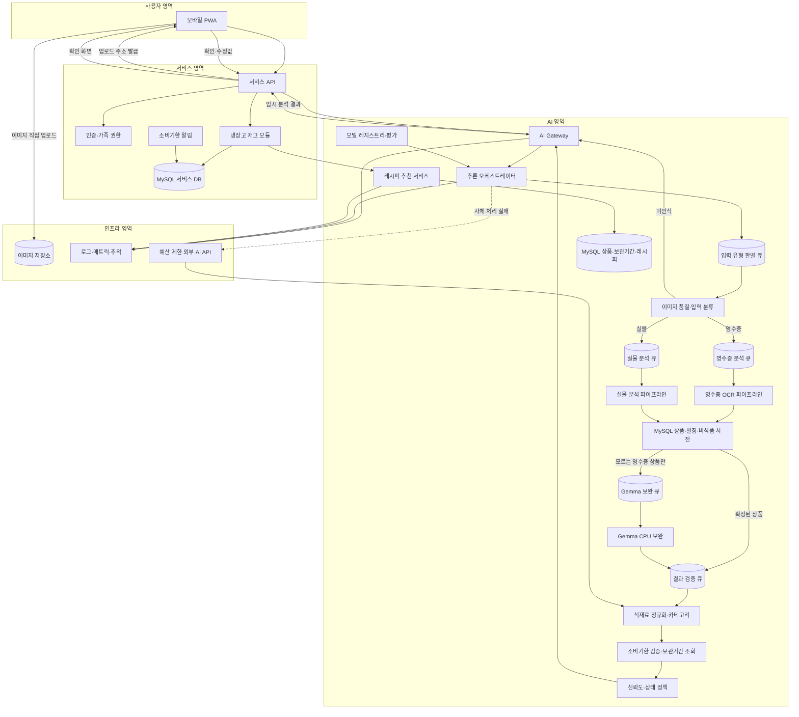

# 단계 3: 서비스 아키텍처 모듈화

## 1. 이 구조가 우리 서비스에 필요한 이유

스마트 냉장고의 AI 기능은 이미지 분석과 레시피 추천이라는 성격이 다른 두 흐름으로 구성됩니다. 초기 출시의 이미지 분석은 중앙처리장치 기반 분류·문자 인식·비동기 처리가 필요하고, 레시피 추천은 MySQL 재고 조회·안전 필터·규칙 순위 계산이 중요합니다. 두 기능을 하나의 애플리케이션에 섞으면 이미지 모델 배포가 레시피 추천 장애로 이어지고, 제한적으로 사용하는 외부 API를 다른 방식으로 교체할 때 백엔드까지 수정해야 합니다.

따라서 사용자 서비스, 이미지 분석, 레시피 추천, 모델 운영을 분리합니다. 단, 초기부터 모든 기능을 독립 서버로 배포하는 것은 현재 예산에 맞지 않습니다. **코드와 책임은 모듈로 분리하고, 배포는 트래픽에 맞춰 단계적으로 분리**합니다.

여기서 모듈화는 파일이나 클래스 이름만 나누는 것을 뜻하지 않습니다. 한 클래스가 요청 검증, 모델 호출, 결과 판정, 데이터 저장까지 모두 처리하는 God Class·God Object를 만들지 않도록 **다른 책임과 데이터 수정 권한을 분리**합니다. 초기 AI 모델 작업자는 한 EC2 안에서 별도 프로세스로 실행하고 큐로 연결합니다. 같은 프로세스 안의 가벼운 정책 모듈도 공개 인터페이스를 통해서만 협력하게 합니다.

## 2. 목표 아키텍처



### 2.1 현재 구현과 목표 구조의 구분

위 그림은 2단계 실험 결과를 반영한 초기 출시 목표 구조입니다.

| 구분 | 확인된 상태 |
| --- | --- |
| 현재 연결·실험 완료 | MobileNetV3 입력 유형 분류, PP-OCRv5 문자 인식, Gemma 4비트 중앙처리장치 처리, OCR 원문 일치 검증, 기본 비식품 규칙 |
| 일부 실험 완료 | 반복 상품을 사전에서 찾았을 때 Gemma를 생략하는 흐름 |
| 다음 구현 대상 | 단계별 큐와 모델별 작업자 1개, 전체 문맥을 보존한 좌표 기반 상품행 구성, MySQL 상품·별칭 우선 처리, 외부 API 보완 어댑터 |
| 인프라 확인 필요 | 실제 `m7i.xlarge` 처리시간·메모리, SQS 연동, 중지된 EC2 자동 시작과 준비 완료 확인 |
| 이후 버전 후보 | 외부 GPU 플랫폼의 이미지 이해 모델, Qwen-VL 운영 서빙, vLLM, 벡터 검색 |

외부 영수증 21장 최초 평가의 종합점수는 87.8%였고, OCR부터 후처리까지 전체 95% 완료시간은 18.44초였습니다. 이후 기존 OCR 결과로 세 번 반복한 후처리 비교에서는 정밀도 95.1%, 재현율 73.6%, 종합점수 83.0%였으며 후처리만의 95% 완료시간은 약 11.9~15.7초였습니다. 두 실험의 시간 측정 범위는 다르며 실제 EC2 측정값도 아닙니다. 현재 결과는 자동 등록 승인 기준을 통과하지 못했으므로, 아키텍처가 완성되더라도 별도 촬영 평가 자료와 실제 EC2 측정을 통과하기 전에는 자동 확정 범위를 확대하지 않습니다.

### 2.2 코드 구조 원칙

| 원칙 | 우리 서비스 적용 방식 |
| --- | --- |
| 하나의 변경 이유 | 문자 인식, 상품행 구성, 정규화, 날짜 검증, 상태 판정을 서로 다른 모듈로 둡니다. |
| 작은 공개 인터페이스 | 다른 모듈은 내부 모델 객체나 테이블에 접근하지 않고 `classify`, `extract`, `normalize`, `evaluate` 같은 공개 기능만 호출합니다. |
| 의존성 역전 | 오케스트레이터는 PP-OCRv5, Gemma, 외부 API의 구체 구현이 아니라 `TextExtractor`, `FoodCandidateClassifier` 인터페이스에 의존합니다. |
| 명령과 조회 분리 | 분석 실행·피드백 저장처럼 상태를 바꾸는 기능과 결과·모델 상태를 읽는 기능을 분리합니다. |
| 데이터 소유권 분리 | 재고 수정은 서비스 API만, 단계별 중간 결과·추적 정보 기록은 해당 작업자만, 최종 분석 응답 저장은 AI Gateway의 결과 저장 기능만, 상품 사전 갱신은 정규화 모듈의 관리 기능만 수행합니다. |
| 실패 격리 | 한 모듈의 실패를 예외로 전체에 전파하지 않고 정해진 실패 결과로 변환하여 `확인 필요` 또는 직접 입력으로 전환합니다. |
| 외부 의존성 격리 | S3, SQS, MySQL, Gemma, 외부 API는 어댑터 뒤에 두어 핵심 규칙이 특정 제품의 SDK에 묶이지 않게 합니다. |
| 읽기 쉬운 이름과 짧은 함수 | 함수는 한 작업만 수행하고, `processData` 같은 이름 대신 `extractReceiptLines`, `rejectNonFoodItem`처럼 의도를 드러냅니다. |

다음 항목은 코드 검토에서 God Class·God Object 신호로 판단합니다.

- 생성자 의존성이 7개 이상으로 계속 증가하는 클래스
- 서로 다른 도메인의 저장소를 두 개 이상 직접 수정하는 클래스
- 분류·문자 인식·정규화·상태 판정을 한 메서드에서 모두 수행하는 코드
- 모델 종류를 확인하는 `if` 또는 `switch`가 여러 모듈에 반복되는 구조
- 요청·응답 객체가 모델 실행 객체와 데이터베이스 객체를 동시에 겸하는 구조
- 한 클래스의 변경이 영수증, 실물, 추천 기능의 테스트를 모두 깨뜨리는 구조

위 신호가 나타나면 단순히 메서드만 잘게 나누지 않고, 책임과 데이터 소유권을 기준으로 클래스를 분리합니다. 다만 클래스 줄 수만으로 기계적으로 쪼개거나 인터페이스를 하나의 구현마다 만들지는 않습니다. 실제로 교체 가능성이 있거나 외부 시스템과 경계를 이루는 지점에 인터페이스를 둡니다.

## 3. 모듈별 책임과 분리 이유

### 3.1 서비스 API

**책임**

- 사용자 인증과 냉장고 접근 권한 확인
- 이미지 업로드와 분석 요청 생성
- AI 결과를 사용자 화면 형식으로 변환
- 사용자 수정값을 재고와 AI 피드백으로 전달

**분리 이유**

AI API에 사용자 인증과 가족 권한을 중복 구현하지 않기 위해 서비스 경계를 유지합니다. AI는 식재료 분석에 집중하고 사용자가 어떤 냉장고에 접근 가능한지는 서비스가 결정합니다.

### 3.2 AI Gateway

**책임**

- AI 내부 API의 단일 진입점
- 요청 스키마 검증과 멱등성 보장
- 작업 상태 및 모델 버전 추적
- 요청량 제한과 비용 한도 적용
- 자체 경로와 외부 보완 결과를 동일한 형식으로 변환

AI Gateway는 이미지 내용을 분석하거나 상품명을 정규화하지 않습니다. 사용자 재고도 직접 수정하지 않습니다.

**분리 이유**

백엔드가 MobileNetV3, PP-OCRv5, Gemma와 외부 인공지능 API별 호출법을 알지 않도록 합니다. 내부 모델이나 외부 공급자가 바뀌어도 서비스 API 계약은 유지됩니다.

### 3.3 추론 오케스트레이터

**책임**

- 입력 유형 판별 결과에 따라 영수증·실물·미인식 경로의 다음 큐로 작업 전달
- 파이프라인 버전에 따른 단계 순서와 허용 가능한 다음 상태 정의
- 단계별 타임아웃, 멱등성, 재시도와 실패 대기열 관리
- 분석 결과와 추적 정보 결합

오케스트레이터는 중앙에서 모든 모델을 직접 호출하는 거대한 클래스가 아닙니다. 파이프라인 상태와 허용 가능한 다음 큐를 정의하고, 실제 단계 전환은 각 작업자가 반환한 결과 계약에 따라 진행합니다. 문자 인식 규칙, 식품 판별 규칙, 날짜 계산식과 상태 임계값을 내부에 넣지 않습니다.

**분리 이유**

영수증과 실물 사진은 필요한 모델이 다릅니다. 분기 로직을 각 모델 안에 넣지 않고 오케스트레이터에서 관리해야 경로별 비용과 성공률을 측정할 수 있습니다.

### 3.4 이미지 품질·입력 분류

**책임**

- 흐림, 어두움, 반사, 잘림 확인
- `RECEIPT`, `PRODUCT`, `OTHER` 분류
- 처리 불가능한 이미지를 조기에 차단
- 추가 학습한 MobileNetV3-Small의 버전과 신뢰도 기록

**분리 이유**

사용할 수 없는 이미지를 비싼 모델에 전달하지 않고 즉시 재촬영을 요청합니다. 이 모듈은 비교적 빠르게 자체 모델로 발전시킬 수 있습니다.

### 3.5 영수증 OCR 파이프라인

**책임**

- 영수증 영역 보정과 전체 문맥 보존
- PP-OCRv5로 문자·신뢰도·좌표 추출
- 헤더·합계 구간과 가격·수량 좌표로 상품행 후보 구성
- 개인정보 마스킹
- MySQL 상품·별칭·비식품 사전 우선 조회
- 사전에 없는 후보는 Gemma 보완 큐로 전달
- OCR 원문과 선택 결과의 일치 여부를 검증할 자료 생성

**분리 이유**

영수증은 객체 인식보다 문서 구조와 한국어 문자 인식 이후의 상품행 판별이 중요합니다. 21장 반복 확인에서 정밀도 95.1%에 비해 재현율이 73.6%였고 긴 영수증 누락이 집중됐습니다. 그러나 고정 길이 분할과 상품 영역만 선제 입력하는 방식은 정확도를 낮췄으므로, 실물 분석과 분리해 종이 영역 보정과 전체 문맥을 유지한 좌표·가격·수량 관계 구성을 독립적으로 개선합니다.

### 3.6 실물 분석 파이프라인

**책임**

- 바코드와 패키지 특징 인식
- 비포장 식재료 및 복수 객체 후보 탐지
- 상품명·수량·날짜 영역 후보 생성
- 자체 경로가 확정하지 못한 어려운 사례만 외부 인공지능 API로 라우팅

**분리 이유**

포장 식품과 비포장 재료는 시각적 특징이 중요합니다. OCR 실패와 상품 인식 실패를 구분해야 필요한 학습 데이터를 정확히 수집할 수 있습니다.

### 3.7 식재료 정규화·카테고리 모듈

**책임**

- 상품명과 OCR 문자열을 표준 식재료명으로 변환
- 고정된 열한 개 카테고리 중 하나로 분류
- 제품 수량과 용량을 분리하고 용량을 `g` 또는 `ml`로 표준화
- 동의어·브랜드명·축약 상품명 사전 관리
- `OTHER`와 식별 실패를 구분

**분리 이유**

이미지 분석 과정이 반환한 자유로운 상품명을 재고와 레시피에서 바로 사용하면 같은 재료가 여러 이름으로 저장됩니다. 표준 식재료 ID를 공통 계약으로 사용해야 레시피 검색 품질이 유지됩니다.

### 3.8 소비기한 검증·보관기간 조회 모듈

**책임**

- OCR 날짜 형식과 미래·과거 범위 검증
- 제조일, 소비기한, 유통기한의 의미 구분
- 표시 날짜가 없을 때 MySQL의 식재료별 보관기간 자료 조회
- 보관조건과 자료 버전이 있는 추정 기간 반환

**분리 이유**

이미지에서 읽은 날짜와 지식으로 예상한 날짜는 신뢰 수준이 다릅니다. 이 모듈에서 출처와 가정을 강제하여 UI와 알림에서 혼동되지 않게 합니다.

### 3.9 신뢰도·상태 정책 모듈

**책임**

- 모델 신뢰도, 필수값, 화질, 날짜 규칙을 종합
- `RECOGNIZED`, `UNRECOGNIZED`, `NEEDS_REVIEW`, `AI_ESTIMATED` 결정
- 사용자에게 보여줄 확인 사유 생성
- 모델 버전별 임계값 관리

**분리 이유**

모델이 스스로 자신을 `인식 성공`으로 판정하게 두지 않습니다. 서비스의 안전 기준을 모델 밖의 정책으로 두면 모델 교체 후에도 동일한 사용자 경험을 유지할 수 있습니다.

### 3.10 레시피 추천 모듈

**책임**

- 재고 스냅샷과 사용자 조건 검증
- 알레르기·비선호 재료 선제 제외
- MySQL에서 레시피 후보 조회
- 임박 재료 활용도 기반 랭킹
- 정해진 가중치와 템플릿으로 추천 이유와 부족 재료 반환

**분리 이유**

이미지 분석은 재고 등록 시 발생하지만 레시피 추천은 사용자가 식사를 고민할 때 반복됩니다. 초기에는 같은 배포 안의 독립 모듈로 두고, 트래픽이나 변경 주기가 실제로 달라졌을 때만 별도 서비스로 분리합니다. 초기 출시에서는 벡터 데이터베이스나 생성 모델을 필수 구성으로 두지 않습니다.

### 3.11 모델 레지스트리·평가 모듈

**책임**

- 모델, 프롬프트, 데이터, 정책 버전 관리
- 고정 평가 세트 결과 보관
- 배포 승인 기준 확인
- 카나리와 롤백 대상 관리

**분리 이유**

외부 API 결과와 자체 모델을 같은 기준으로 비교하고, 정확도 저하 없이 점진적으로 자체 모델 비중을 높이기 위해 필요합니다.

### 3.12 모듈 내부 계층

각 AI 모듈은 다음 네 영역을 기본 구조로 사용합니다. 작은 모듈은 디렉터리를 억지로 모두 만들지 않아도 되지만 의존 방향은 유지합니다.

```text
module
├─ domain          # 식품 후보, 소비기한, 상태 판정 등 순수 규칙
├─ application     # 한 가지 사용 흐름을 실행하는 기능
├─ ports           # 필요한 저장소·모델·외부 서비스 인터페이스
└─ adapters        # PP-OCRv5, Gemma, MySQL, S3, SQS, 외부 API 구현
```

의존 방향은 `adapters → ports ← application → domain`을 따릅니다. `domain`은 AWS SDK, 웹 프레임워크, ORM, Ollama 같은 실행 기술을 import하지 않습니다. 이 구조를 사용하면 PP-OCRv5를 외부 OCR로 교체하거나 MySQL 조회 방식을 바꿔도 상품 판정 규칙과 테스트를 유지할 수 있습니다.

대표 인터페이스는 다음과 같이 작게 유지합니다.

```text
InputClassifier.classify(image) -> InputTypeResult
TextExtractor.extract(image) -> OcrDocument
ReceiptRowBuilder.build(document) -> ReceiptRowCandidate[]
ProductCatalog.find(candidate) -> ProductMatch
FoodCandidateClassifier.classify(candidate) -> FoodCandidateResult
IngredientNormalizer.normalize(candidate) -> NormalizedIngredient
ExpirationPolicy.evaluate(candidate, knowledge) -> ExpirationResult
RecognitionPolicy.evaluate(context) -> RecognitionStatus
```

어떤 구현도 다음 단계의 내부 객체를 직접 수정하지 않습니다. 각 단계는 변경 불가능한 결과 메시지를 새로 만들고 다음 큐로 전달합니다. 오케스트레이터는 허용된 상태 전환과 버전만 검증하며 중간 결과 내용을 직접 고치지 않습니다.

### 3.13 데이터 수정 권한

| 데이터 | 읽을 수 있는 모듈 | 수정할 수 있는 모듈 | 제한 이유 |
| --- | --- | --- | --- |
| 사용자·가족 권한 | 서비스 API | 인증·권한 모듈 | AI 코드가 사용자 권한을 우회하지 못하게 함 |
| 냉장고 재고 | 서비스 API, 추천 모듈 | 재고 모듈 | 모델 결과가 사용자 확인 없이 재고를 변경하지 못하게 함 |
| 원본 이미지 | 이미지 분석 작업자 | 서비스 API의 업로드·삭제 기능 | 모델과 일반 로그가 원본을 임의 보관하지 못하게 함 |
| 단계별 중간 결과·추적 정보 | 다음 단계 작업자, AI Gateway, 평가 모듈 | 해당 단계 작업자 | 자신의 단계 결과만 기록하고 다른 단계 결과를 덮어쓰지 않음 |
| 최종 분석 응답 | 서비스 API, 평가 모듈 | AI Gateway의 결과 저장 기능 | 검증을 마친 분석 응답을 저장하며 사용자 확정값과 분리해 보존 |
| 상품·별칭·비식품 사전 | 분석 모듈 | 정규화 관리 기능 | 여러 모델이 서로 다른 표준명을 직접 등록하지 못하게 함 |
| 보관기간 자료 | 소비기한 모듈, 추천 모듈 | 승인된 지식 관리 기능 | 추정 날짜의 근거와 버전을 유지 |
| 사용자 확정값 | 평가 모듈 | 피드백 수집 기능 | 원본 예측을 덮어쓰지 않고 학습 자료로 분리 |
| 모델·정책 버전 | 오케스트레이터, 평가 모듈 | 모델 레지스트리 | 실행 코드가 승인 없이 운영 모델을 교체하지 못하게 함 |

데이터베이스 계정도 권한에 맞게 나눕니다. AI 작업자는 필요한 상품 자료를 읽고 자신이 담당한 단계의 중간 결과·추적 정보만 기록합니다. 결과 검증 작업자는 검증된 결과를 AI Gateway의 결과 저장 인터페이스로 전달하며 최종 분석 응답 테이블을 직접 수정하지 않습니다. AI Gateway의 결과 저장 기능이 완료 상태와 최종 응답을 일관되게 저장합니다. AI 작업자와 AI Gateway 모두 사용자 재고 테이블 수정 권한은 갖지 않습니다. 추천 모듈은 재고와 레시피를 읽을 수 있지만 상품 사전과 사용자 재고를 수정하지 않습니다.

## 4. 모듈 간 인터페이스

| 송신 | 수신 | 방식 | 주요 데이터 |
| --- | --- | --- | --- |
| 모바일 PWA | 서비스 API | HTTPS REST | 업로드 주소 요청, 분석 요청, 사용자 확인값 |
| 모바일 PWA | Amazon S3 | HTTPS PUT | 크기를 조절·압축한 이미지 파일 |
| 서비스 API | AI Gateway | 내부 HTTPS REST | 이미지 참조, 요청 ID, 로케일 |
| AI Gateway | 추론 오케스트레이터 | 내부 호출 | 분석 ID, 이미지 키, 파이프라인 버전 |
| 오케스트레이터 | 입력 유형 판별 큐 | 메시지 큐 | 분석 ID, 이미지 키, 입력 힌트 |
| 입력 유형 작업자 | 영수증·실물 큐 | 메시지 큐 | 분석 ID, 판별 유형, 품질 결과 |
| 영수증 작업자 | Gemma 보완·결과 검증 큐 | 메시지 큐 | OCR 문서, 상품행 후보, 사전 조회 결과 |
| 실물 작업자 | 결과 검증 큐 | 메시지 큐 | 바코드·상품명·날짜·용량 후보 |
| Gemma 작업자 | 결과 검증 큐 | 메시지 큐 | OCR 원문과 일치하는 식품행 후보 |
| AI Gateway | 서비스 API | REST 조회 또는 완료 이벤트 | 상태, 식재료 후보, 근거, 모델 추적 |
| 서비스 API | 레시피 추천 모듈 | 초기에는 내부 함수, 분리 후 HTTPS REST | 재고 버전, 표준 식재료, 취향·안전 조건 |
| 추천 모듈 | MySQL | SQL 질의 | 표준 식재료 ID, 태그, 조리조건, 보관기간 자료 |
| 서비스 API | AI Gateway | 내부 HTTPS REST | 사용자 확정값과 모델 개선 동의 |

정규화·날짜 검증처럼 가벼운 내부 모듈은 초기에는 같은 프로세스의 함수 호출이어도 됩니다. 모델 실행 단계는 같은 EC2 안에서도 작업자 프로세스와 큐를 분리합니다. 입력·출력 스키마와 책임 경계는 이후 작업자를 별도 인스턴스로 옮겨도 유지되도록 설계합니다.

### 4.1 분석 작업 메시지

AI Gateway가 처음 넣는 메시지는 모델별 세부 입력이 아니라 분석 작업 계약을 포함합니다. 이후 단계 메시지는 같은 식별자와 버전을 유지하고 이전 단계가 만든 결과의 저장 위치와 다음 작업에 필요한 최소 정보만 추가합니다.

```json
{
  "schemaVersion": "1.0",
  "analysisId": "ana_01JEXAMPLE",
  "requestId": "req_01JEXAMPLE",
  "imageKey": "uploads/2026/09/02/image-001.webp",
  "inputHint": "AUTO",
  "locale": "ko-KR",
  "pipelineVersion": "image-analysis-1.0.0",
  "stage": "TYPE_QUEUED",
  "attempt": 1
}
```

작업자에게 사용자 인증 토큰이나 냉장고 수정 권한을 전달하지 않습니다. 작업자는 `analysisId`에 속한 자신의 단계 중간 결과만 기록하고, 최종 분석 응답은 AI Gateway의 결과 저장 기능을 통해 저장합니다. 재고 반영 여부는 서비스 API가 사용자 확인 후 결정합니다.

각 큐에는 대응하는 실패 대기열을 두고 재시도 횟수를 제한합니다. 단계 전환은 `analysisId + stage + pipelineVersion`을 멱등성 키로 사용하여 같은 메시지가 다시 전달돼도 중복 모델 실행이나 결과 중복 저장을 막습니다.

### 4.2 호환성과 실패 계약

- 단계 1의 `/ai/v1` 요청·응답 계약을 모듈 간 외부 경계에서도 사용합니다.
- 기존 필드의 의미와 자료형을 바꾸지 않고 새로운 선택 필드만 추가합니다.
- 호환되지 않는 변경은 새 API 버전과 새 `schemaVersion`으로 분리합니다.
- 소비자는 알 수 없는 선택 필드를 무시하고, 필수 버전을 지원하지 못하면 처리하지 않습니다.
- 메시지 재처리를 대비해 `requestId`와 `analysisId`로 멱등성을 보장합니다.
- 내부 예외 문자열을 전달하지 않고 `INVALID_INPUT`, `MODEL_TIMEOUT`, `DEPENDENCY_UNAVAILABLE`처럼 합의된 오류 코드로 변환합니다.
- 모델·규칙·상품 사전 버전은 분석 시작 시 고정하고 결과에도 같은 버전을 기록합니다.
- 시간 초과와 재시도 횟수는 오케스트레이터가 관리하고, 각 모델 어댑터는 성공 또는 명시적인 실패 결과만 반환합니다.

## 5. 핵심 데이터 계약

### 표준 식재료

```json
{
  "ingredientId": "ing_milk",
  "canonicalName": "우유",
  "category": "DAIRY",
  "aliases": ["서울우유", "흰우유", "밀크"],
  "quantity": {"value": 2, "unit": "PACK"},
  "capacity": {
    "value": 1000,
    "unit": "ML",
    "scope": "PER_ITEM",
    "source": "OCR"
  },
  "source": "USER_CONFIRMED"
}
```

용량이 보이지 않으면 `capacity`는 `null`로 유지합니다. 레시피 추천은 용량이 확인된 재료에 대해서만 정량 충족률을 계산하고, 용량이 없는 재료는 보유 여부 중심으로 평가합니다.

### 추론 추적

```json
{
  "analysisId": "ana_01JEXAMPLE",
  "pipelineVersion": "image-analysis-1.0.0",
  "route": ["quality-0.2", "receipt-ocr-0.4", "normalizer-0.3"],
  "externalFallbackUsed": false,
  "latencyMs": 2840,
  "externalApiCostKrw": 0
}
```

추천 결과는 점수만 주지 않고 `사용한 임박 재료`, `보유 재료`, `부족 재료`, `제외 조건`, `출처`를 포함해야 합니다. 그래야 사용자가 추천 이유를 이해하고 백엔드가 장보기 목록을 만들 수 있습니다.

## 6. 배포 단계

### 1단계: 3개월 초기 출시 구성

- 서비스 API와 AI Gateway는 배포 단위를 분리합니다.
- PWA는 S3에 이미지를 직접 업로드하고 서비스 API에는 이미지 위치만 전달합니다.
- SQS를 입력 유형, 영수증, 실물, Gemma 보완, 결과 검증 단계로 분리해 여러 사용자의 요청을 보관합니다.
- EC2 `m7i.xlarge` 한 대에서 모델별 작업자 프로세스를 하나씩 실행합니다. 같은 모델은 한 번에 한 요청만 처리하고 서로 다른 모델 작업자는 파이프라인처럼 동시에 동작합니다.
- AI 내부 모듈은 작업자별로 명확한 패키지와 권한 경계를 유지하고 다른 작업자의 내부 모델 객체를 직접 호출하지 않습니다.
- MobileNetV3-Small, PP-OCRv5, MySQL 사전, Gemma 4 5.1B 4비트 모델과 결정 규칙을 중앙처리장치에서 실행합니다.
- 레시피 추천은 MySQL 조회와 규칙 점수 계산을 담당하는 독립 코드 모듈로 운영합니다.
- 중지된 AI 서버는 대기열 요청에 따라 자동으로 시작하고, 준비시간과 추론시간을 따로 기록합니다.

현재 팀 규모와 예산에는 이 구성이 적합합니다. 처음부터 모듈마다 인스턴스를 만들지 않습니다.

### 초기 배포 단위와 독립 확장 조건

| 논리 모듈 | 초기 배포 단위 | 독립 분리·확장 조건 | 독립 배포 시 유지할 계약 |
| --- | --- | --- | --- |
| 서비스 API | 백엔드 서버 | 사용자 요청 증가 | `/ai/v1` 요청·조회 계약 |
| AI Gateway | AI API 서버 | 분석 접수량 또는 상태 조회량 증가 | 분석 ID와 작업 상태 계약 |
| 입력 유형 판별 | EC2의 MobileNetV3 작업자 1개 | 입력 유형 큐 대기시간이 목표 초과 | 입력 유형 작업 메시지와 `InputTypeResult` |
| 영수증 분석 | EC2의 PP-OCRv5 작업자 1개 | 영수증 큐 대기시간·95% 완료시간 초과 | OCR 문서와 상품행 후보 스키마 |
| 실물 분석 | EC2의 실물 작업자 1개 | 실물 큐 대기시간·외부 보완 비율 초과 | 실물 분석 결과 스키마 |
| Gemma 보완 | EC2의 Gemma 작업자 1개 | 모르는 상품 요청이 늘어 보완 큐 대기시간 초과 | `FoodCandidateClassifier` 인터페이스 |
| 결과 검증 | EC2의 검증 작업자 1개 | 검증 큐가 병목이 되거나 저장 지연 발생 | 공통 분석 결과 스키마 |
| 외부 API 어댑터 | AI 작업자 내부 어댑터 | 공급자별 한도·장애 격리가 필요 | 동일한 외부 보완 결과 스키마 |
| 레시피 추천 | 백엔드의 독립 모듈 | 추천 트래픽이나 배포 주기가 이미지 분석과 달라짐 | 단계 1 추천 요청·응답 계약 |

독립 확장은 인스턴스를 무조건 늘리는 것이 아닙니다. SQS 대기시간, 중앙처리장치 사용률, 최대 메모리, 오류율을 근거로 병목 모듈만 분리합니다. 상태를 작업자 메모리에 보관하지 않아 동일 계약을 구현한 작업자를 추가해도 요청 결과가 달라지지 않게 합니다.

### 2단계: 실제 부하를 근거로 배포 분리

- 영수증 문자 인식과 실물 분석 작업자를 독립 배포합니다.
- 레시피 추천 서비스를 독립 확장합니다.
- 외부 인공지능 API 보완 경로를 별도 어댑터로 분리합니다.
- 단계별 큐 계약은 유지하면서 병목 작업자만 별도 EC2 또는 외부 실행 환경으로 옮깁니다.

이 단계는 초기 출시부터 적용하지 않습니다. 큐 대기시간, 메모리 사용량, 요청 비율과 장애 영향 범위를 측정해 한 EC2 안의 모델별 작업자 구성으로 감당하기 어렵다는 근거가 생겼을 때 진행합니다.

### 3단계: V2 이후 모델 서빙 고도화

- 이미지 이해 모델이 꼭 필요하고 외부 API보다 유리하다는 품질·비용 근거가 있을 때만 자체 모델 서빙을 검토합니다.
- 그래픽 처리장치는 AWS 클라우드 예산이 아니라 월 12만 원의 AI 예산 안에서 외부 GPU 플랫폼을 비교합니다.
- Qwen-VL이나 vLLM은 현재 확정 구성이 아니며 후보 모델과 서빙 도구로만 평가합니다.
- 모델별 카나리 배포와 자동 롤백을 구성합니다.
- GPU 작업자는 큐 길이에 맞춰 실행시간을 통제합니다.

## 7. 장애 격리와 대체 동작

| 장애 | 영향 범위 | 대체 동작 |
| --- | --- | --- |
| 외부 인공지능 API 장애 | 자체 경로가 실패한 어려운 이미지 | 자체 결과를 `확인 필요`로 반환하거나 직접 입력 안내 |
| OCR 워커 장애 | 영수증과 날짜 인식 | 작업 재시도 후 수동 등록 제공 |
| 실물 분석 작업자 장애 | 실물 사진 인식 | 바코드·상품 검색 또는 직접 입력 제공 |
| MySQL 보관기간 조회 장애 | AI 예상 날짜 | 추정하지 않고 날짜 미입력 상태 유지 |
| 레시피 추천 모듈 장애 | 신규 추천 | 최근 캐시 결과 제공 또는 잠시 후 재시도 |
| 모델 성능 저하 | 특정 버전의 오인식 증가 | 이전 모델·정책 버전으로 롤백 |

## 8. 변경 시 영향 범위 예시

### 카테고리가 추가되는 경우

- 정규화·카테고리 모듈과 API enum 버전을 변경합니다.
- 고정 평가 세트와 프론트 표시명을 추가합니다.
- 문자 인식과 실물 분석 모델은 원본 이름 후보만 반환하므로 즉시 재학습할 필요는 없습니다.

### 외부 보완 API를 다른 공급자나 자체 모델로 교체하는 경우

- 오케스트레이터의 모델 어댑터와 배포 설정만 교체합니다.
- AI Gateway의 공개 응답 계약은 유지합니다.
- 초기 출시의 CPU 자체 경로는 그대로 유지합니다.
- 별도 평가 세트에서 품질·지연·비용을 통과한 후 보완 요청만 점진적으로 이동합니다.

### 추천 점수 가중치를 바꾸는 경우

- 레시피 랭커와 추천 정책 버전만 변경합니다.
- 이미지 분석과 냉장고 재고 API는 영향을 받지 않습니다.
- 기존·신규 점수를 오프라인 평가하거나 A/B 테스트할 수 있습니다.

### 소비기한 지식이 갱신되는 경우

- MySQL 보관기간 자료 버전과 관련 캐시만 갱신합니다.
- 실제 OCR 날짜는 변경하지 않습니다.
- 어떤 지식 버전으로 추정했는지 추적할 수 있습니다.

## 9. 운영 관측성

모든 분석 요청에는 `requestId`, `analysisId`, `pipelineVersion`을 연결합니다.

### 필수 대시보드

- 영수증·실물·기타 입력 비율
- 파이프라인별 p50·p95 지연시간
- 자체 모델 처리율과 외부 보완 비율
- 모델·필드별 사용자 수정률
- 상태값 분포와 재촬영률
- 외부 API 및 AWS 비용
- 레시피 추천의 보유 재료 활용률
- 임박 재료 추천 반영률
- 알레르기 필터 차단 건수

원본 이미지와 OCR 전문은 일반 로그에 남기지 않습니다. 오류 분석이 필요한 샘플은 사용자 동의와 제한된 접근권한 아래 별도 보관합니다.

## 10. 모듈화의 기대 효과

- 이미지 모델을 교체해도 프론트와 냉장고 재고 코드를 수정하지 않습니다.
- 영수증 OCR과 실물 인식을 각기 다른 데이터와 지표로 개선할 수 있습니다.
- 외부 API 의존도를 모듈별로 단계적으로 낮출 수 있습니다.
- 이미지 분석 장애가 레시피 조회나 기존 재고 확인까지 확산되지 않습니다.
- 초기 출시에서는 그래픽 처리장치를 운영하지 않아 AWS 예산을 통제하고, 이후 필요성이 입증된 모델만 AI 예산 안에서 별도로 검토할 수 있습니다.
- 사용자 수정 데이터가 어느 모델의 어떤 오류인지 추적되어 재학습에 활용됩니다.
