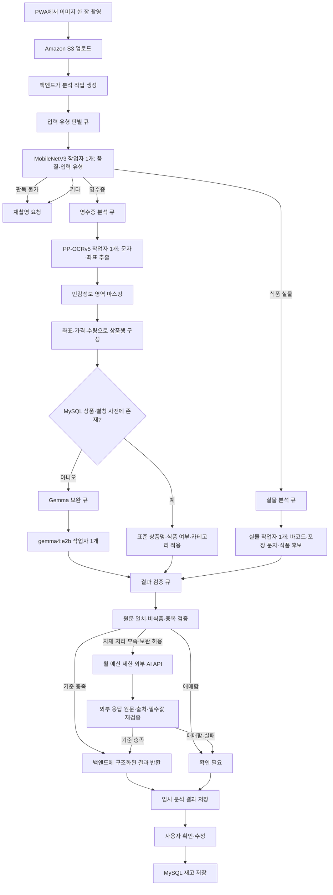
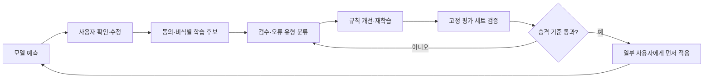

# 단계 2: 모델 추론 성능 최적화

## 1. 우리가 이 최적화를 하는 이유

우리 서비스의 이미지 분석 결과는 냉장고 재고와 소비기한 알림의 입력값이 됩니다. 처리 속도가 빨라도 종량제봉투를 식재료로 등록하거나 영수증 거래일을 소비기한으로 저장하면 서비스 신뢰도가 떨어집니다. 반대로 모든 사진을 이미지와 문자를 함께 이해하는 대형 모델에 전달하면 서버 부하, 외부 인공지능 서비스 비용, 대기시간이 함께 증가합니다.

따라서 이번 단계의 목표는 모델 하나의 속도만 높이는 것이 아닙니다. 선명하고 단순한 이미지는 자체 서버의 빠른 분석 과정으로 처리하고, 불확실한 결과는 자동 확정하지 않으며, 자체 경로로 해결하기 어려운 요청만 처리 시간이 긴 이미지 이해 모델로 보내는 구조를 만드는 것입니다.

이번 초기 기능 검증 실험을 통해 중앙처리장치(CPU) 기반 문자 인식 속도보다 다음 후처리 품질이 우선 병목이라는 사실을 확인했습니다.

- 영수증에서 상품행과 안내·결제 문구를 구분하는 문제
- 식품과 종량제봉투 같은 비식품을 구분하는 문제
- 축약되거나 잘못 읽힌 상품명을 표준 식재료명으로 바꾸는 문제
- 거래일·제조일·소비기한을 문맥으로 구분하는 문제
- 상품명·수량·용량·날짜가 어느 상품에 속하는지 연결하는 문제

### 현재 결론

현재 운영 후보는 `MobileNetV3-Small → PP-OCRv5 → MySQL 상품·비식품 사전 → 필요한 경우에만 CPU Gemma → 결정 규칙`입니다. 사용자 제공 외부 영수증 21장의 최초 실행 종합점수는 87.8%였고, 이 최초 실행의 OCR 포함 전체 95% 완료시간은 18.44초였습니다. 이후 기존 OCR 결과로 세 번 반복한 후처리 비교의 종합점수는 83.0%였으며, 후처리만의 95% 완료시간은 약 11.9~15.7초였습니다. 두 실험의 시간 측정 범위는 다르며 실제 EC2 측정값도 아닙니다. 정확도와 처리시간 목표를 충족했다고 볼 수 없으므로 `RECOGNIZED` 후보 범위를 확대하지 않습니다. 분석 상태와 관계없이 사용자 확인 전에는 재고에 저장하지 않습니다. 다음 개선의 우선순위는 긴 영수증 상품행 누락, 비식품 오선택, 표준 상품명 정규화, 느린 요청 제한입니다.

## 2. 확정된 조건과 이번 단계의 범위

### 인프라와 예산

- 초기 출시 버전의 운영 가이드와 예산에 따라 AWS 그래픽 처리장치 인스턴스를 사용하지 않고 중앙처리장치 기반으로 설계합니다.
- 설치형 웹 앱(PWA)은 촬영, 이미지 크기 조절·압축, 업로드, 작업 상태 조회와 사용자 확인만 담당합니다.
- 자체 분류·바코드·문자 인식·검증 규칙은 AWS EC2 서버의 중앙처리장치에서 실행합니다.
- 초기 출시 버전에서는 AWS 그래픽 처리장치와 Qwen-VL 그래픽 처리장치 서빙을 사용하지 않습니다.
- 자체 모델은 AWS EC2 중앙처리장치에서 실행하고, 자체 경로가 품질·시간 기준을 충족하지 못한 일부 요청만 외부 인공지능 API로 보완합니다.
- V2 이후 그래픽 처리장치 서빙이 필요하면 AWS가 아닌 외부 GPU 플랫폼을 AI 예산 안에서 별도 검증합니다.
- 관리형·외부 서비스는 모든 요청에 사용하지 않고 자체 경로가 실패한 일부 요청에만 적용합니다.
- 외부 API 키는 설치형 웹 앱에 포함하지 않고 서비스 서버에서 안전하게 관리합니다.
- 외부 인공지능 서비스 예산은 월 12만 원, 3개월 총 36만 원이며 자체 인공지능 서버에 사용할 AWS 월 예산은 10~15만 원으로 제한합니다.
- 서비스 원본 데이터는 팀이 선택한 MySQL 관계형 데이터베이스에 저장하며, 3개월 초기 출시 버전에서는 별도 벡터 데이터베이스를 운영하지 않습니다.

### 우선 범위

이번 단계의 핵심 범위는 다음과 같습니다.

1. 한 장의 이미지를 `영수증`, `식품 실물`, `기타`로 분류합니다.
2. 영수증이면 식품 상품행을, 식품 실물이면 식품명·카테고리·수량·용량을 추출합니다.
3. 기타 또는 판독 불가능한 사진이면 값을 만들지 않고 재촬영을 요청합니다.
4. 필드별 근거와 신뢰도를 검증하여 `인식`, `미인식`, `확인 필요`, `AI 예상`을 결정합니다.
5. 여러 사용자의 동시 업로드를 작업 유실 없이 처리합니다.

레시피 추천은 MySQL에 정리한 재료 관계와 규칙 기반 순위 계산으로 시작합니다. 의미 유사도 검색, 벡터 데이터베이스, 학습 순위 모델은 3개월 초기 출시 버전의 필수 범위가 아니라 검색 품질이 부족할 때 검증할 확장 항목으로 둡니다.

## 3. 예상 운영 구성과 처리 흐름

### 3.1 배포 구성

| 구성 요소 | 예상안 | 담당 역할 |
| --- | --- | --- |
| 사용자 화면 | 설치형 웹 앱(PWA) | 촬영·압축·업로드·진행 상태·결과 확인 |
| 이미지 저장 | Amazon S3 | 원본 이미지와 분석용 이미지 보관 |
| 단계별 작업 대기열 | Amazon SQS | 입력 유형, 영수증, 실물, Gemma 보완, 결과 검증 작업을 분리해 보관 |
| AI 서버 | `m7i.xlarge`, 4 vCPU·16GB RAM | 모든 자체 모델 추론 수행 |
| AI 서버 디스크 | 암호화한 `gp3 50GB` | 운영체제·Docker·모델·임시파일 저장 |
| 입력 유형 모델 | 추가 학습한 MobileNetV3-Small | 영수증·식품 실물·기타 분류 |
| 한국어 문자 인식 | PP-OCRv5 모바일 검출·한국어 모바일 인식 | 문자·신뢰도·좌표 추출 |
| 상품행 구성 | 좌표·가격·수량·헤더 규칙 | 상품명과 가격·수량을 같은 구매 항목으로 연결 |
| 상품 판별 자료 | MySQL 상품·별칭·비식품 사전 | 식품 여부·표준명·카테고리 우선 확정 |
| 모르는 상품 판별 | Ollama `gemma4:e2b` (`5.1B`, `Q4_K_M`) | 문자 인식 원문 중 식품 상품행 선택과 후보 제안 |
| 최종 검증 | 결정 규칙 | 원문 일치·비식품·중복·필수값·날짜 오류 검사 |
| 보완 경로 | 외부 인공지능 API | 자체 경로로 처리하지 못한 일부 요청만 월 12만 원 안에서 보완 |

프로젝트 개발·시연 기간에는 `m7i.xlarge`를 필요한 시간에만 실행하고 중지 상태에서는 EBS만 유지합니다. 불특정 사용자가 언제든 요청하는 공개 운영 단계에서는 수동 시작을 전제로 할 수 없습니다. 백엔드는 항상 요청을 접수하고, AI 서버가 중지돼 있으면 자동 시작 작업이 EC2를 켠 뒤 대기열을 처리하도록 구성해야 합니다. Amazon SQS는 작업을 보관할 뿐 EC2를 직접 시작하지 않으므로 Lambda·EventBridge·Systems Manager 중 팀 클라우드 구성이 선택한 자동화가 별도로 필요합니다.

입력 유형, 영수증, 실물, Gemma 보완 모델은 각각 작업자 하나만 실행합니다. 같은 모델은 요청을 직렬로 처리하지만 서로 다른 모델은 동시에 동작하여 여러 사용자의 요청이 파이프라인을 따라 겹쳐 처리됩니다. 16GB 안에서 중앙처리장치와 메모리 경쟁을 통제하고, 처리량이 부족하면 모델 복제보다 병목 큐의 대기시간과 외부 보완 경로를 먼저 확인합니다. 중지 상태에서 시작하는 요청은 인스턴스 시작과 모델 준비시간이 추가되므로 따뜻한 서버의 추론시간과 분리해 측정하고 사용자에게 예상 대기시간을 표시합니다.

| 큐 | 담당 작업자 | 초기 동시 처리 수 |
| --- | --- | ---: |
| 입력 유형 판별 큐 | MobileNetV3 작업자 1개 | 1 |
| 영수증 분석 큐 | PP-OCRv5 작업자 1개 | 1 |
| 실물 분석 큐 | 바코드·포장 OCR·실물 분석 작업자 1개 | 1 |
| Gemma 보완 큐 | `gemma4:e2b` 작업자 1개 | 1 |
| 결과 검증 큐 | 정규화·날짜·상태 정책 작업자 1개 | 1 |

위 제한은 모델별 제한이므로 전체 서비스의 동시 처리 수가 1이라는 뜻이 아닙니다. 서로 다른 다섯 단계에는 서로 다른 요청이 동시에 존재할 수 있습니다. 실제 `m7i.xlarge`에서 결합 최대 메모리나 중앙처리장치 경합이 기준을 넘을 때만 무거운 단계의 시작을 잠시 늦추며, 요청 자체는 각 큐에 보존합니다.

### 3.2 전체 서비스 흐름



### 3.3 영수증 내부 처리 흐름

아래 흐름은 최초 21장 실험과 후속 교차검증을 함께 반영한 목표 구조입니다. 상품 영역만 선제 입력하거나 긴 OCR를 고정된 줄 수로 나누는 방식은 누락을 늘렸으므로 적용하지 않습니다. 전체 OCR 문맥을 유지하면서 좌표·상품명·가격·수량 관계를 후보 정보로 제공하고, 상품 후보가 하나도 없을 때만 상품 영역을 다시 구성해 한 번 재시도합니다.

```text
PP-OCRv5가 문자와 좌표 추출
→ 카드·전화·주소·회원번호 등 민감정보를 모델 입력과 중간 저장 전에 마스킹
→ 전체 OCR 문맥을 보존
→ 상품명 헤더·합계·가격·수량 좌표 관계를 상품행 후보 정보로 구성
→ MySQL 상품·별칭 사전과 비식품 사전 검색
→ 사전에 없는 후보만 전체 문맥과 함께 Gemma가 식품 여부와 카테고리 제안
→ 상품 후보가 하나도 없을 때만 상품 영역을 재구성해 한 번 재시도
→ Gemma가 만든 이름으로 원문을 덮어쓰지 않고 OCR 상품명 보존
→ 원문 일치·중복·필수값 검증
→ 인식 또는 확인 필요 상태로 반환
```

PP-OCRv5는 문자를 읽는 역할이고, 상품행 구성은 전체 문맥을 버리지 않는 좌표·가격·수량 규칙이 담당하도록 개선합니다. Gemma는 영수증에 없는 상품명을 만드는 모델이 아니라 OCR 원문 중 식품 후보를 선택하는 보완 모델로 제한합니다. 최종 상품명은 MySQL 상품·별칭 자료가 확정하며 근거가 부족하면 자동 등록하지 않습니다.

외부 API는 실물 전용으로 고정하지 않습니다. 영수증 또는 실물 자체 경로가 부족하고 단계 6의 개인정보·예산 조건을 통과한 경우에만 보완 요청을 만들 수 있습니다. 외부 결과도 같은 결정 규칙으로 다시 검증하며, 호출 성공만으로 `인식` 상태를 부여하지 않습니다.

## 4. 성능·병목·최적화 정리

### 4.1 기존 모델 추론 성능 지표

같은 한국 영수증 20장의 사용자 확정 정답을 기준으로 기존 상품행 추출 방식을 측정했습니다.

| 기존 방식 | 정밀도 | 재현율 | 종합점수 |
| --- | ---: | ---: | ---: |
| 규칙 기반 상품행 추출 | 41.2% | 43.8% | 42.4% |
| 소형 문자 분류 모델 | 52.6% | 31.3% | 39.2% |
| 규칙과 문자 분류 모델 후보 결합 | 42.6% | 62.5% | 50.6% |

Apple Vision 문자 인식은 20장 모두에서 글자를 추출했고 처리시간 중앙값은 약 1.17초, 95% 완료시간은 약 1.42초였습니다. 그러나 상품행을 하나도 찾지 못한 영수증이 5장이었고, 필수값 검증 결과 20장 모두 `확인 필요`였습니다. 따라서 기존 경로의 핵심 문제는 문자를 읽는 속도보다 식품 상품행을 정확히 골라내는 품질이었습니다.

### 4.2 식별된 병목과 원인

| 병목 | 관찰 결과 | 원인 |
| --- | --- | --- |
| 개발 20장 상품행 누락 | 20장 중 5장에서 상품행 0개 | 영수증마다 헤더·가격·수량 배치가 다름 |
| 개발 20장 비식품 오선택 | 물티슈·키친타월 등이 식품 후보로 포함 | 문자만으로 식품 여부를 판단하는 규칙 부족 |
| 상품명 오인식 | `콜라→클라`, `포케볼→포켓볼` | 작은 글자·인쇄 품질·문자 모양 유사성 |
| 모델의 상품명 축약 | `불향차돌떡볶이→떡볶이` | 언어 모델이 원문 보존보다 의미 요약을 우선함 |
| 상품 전체 누락 | 메밀국수정식이 OCR 결과에서 사라짐 | 문자 검출 단계에서 상품 영역을 찾지 못함 |
| 외부 21장 상품행 누락 | 식품 상품행 53개 중 10개 누락 | 긴 입력에서 상품행 관계 구성이 부족했고, 후속 실험에서는 영역 제한·고정 분할도 문맥을 끊어 누락을 늘림 |
| 외부 21장 비식품 오선택 | 담배와 전자제품 문자열 2개 선택 | 비식품 사전과 매장·상품 문맥 검증 부족 |
| 상품명 정규화 오류 | 맞힌 상품의 표준명 완전 일치율 62.8% | 축약 상품명·OCR 오인식·언어 모델의 임의 정규화 |
| 처리량 제한 | 외부 21장 전체 경로 중앙값 7.07초, 95% 완료시간 18.44초 | 긴 OCR 입력과 상품행이 없을 때 수행하는 Gemma 재시도 |

### 4.3 적용한 최적화와 구체적 운영 계획

| 구분 | 기존 방식 | 적용·계획한 방식 | 서비스 적용 이유 |
| --- | --- | --- | --- |
| 문자 인식 | 맥 전용 Apple Vision | PP-OCRv5 모바일 검출·한국어 모바일 인식 | Linux EC2 CPU에서 동일 구성으로 운영 가능 |
| 상품행 후보 | 전체 OCR 줄을 먼저 판별하고 실패 시 영역 재시도 | 전체 OCR 문맥은 유지하되 좌표·헤더·가격·수량 관계를 후보 정보로 함께 제공 | 상품 영역만 선제 입력할 때 발생한 비정형 영수증 누락 방지 |
| 식품 판별 | 규칙 또는 소형 문자 분류 | MySQL 사전 우선, 모르는 후보만 Gemma CPU | 정확한 기존 상품은 모델 호출 없이 처리 |
| 언어 모델 출력 | 상품명 자유 생성 | OCR 줄 번호와 원문 완전 일치 검증 | 영수증에 없는 상품 생성 차단 |
| 상품명 저장 | 모델 정규화 이름 우선 | OCR 원문 보존, 모델 값은 별칭 후보 | 구체적인 제품명이 짧게 축약되는 문제 방지 |
| 비식품·중복 | 모델 판단 의존 | 비식품 사전, 매장명 충돌, 묶음·구성품 중복 검사 | 잘못된 재고 자동 등록 방지 |
| 동시 요청 | 요청 즉시 전체 추론 | 단계별 큐와 모델별 작업자 1개로 파이프라인 처리 | 모델 중복 적재 없이 서로 다른 단계의 요청을 동시에 진행 |
| 어려운 요청 | 자체 모델로 강제 처리 | 월 12만 원 한도 외부 API 또는 사용자 확인 | 품질과 예산을 함께 통제 |

이미 적용한 항목은 4비트 Gemma, 모바일 OCR, OCR 줄 번호·원문 일치 검증, 기본 비식품 규칙입니다. 상품 영역 선제 제한과 고정 길이 분할은 이번 교차검증에서 오히려 품질이 낮아져 적용하지 않습니다. 영수증 종이 영역 자르기, 좌표·가격·수량 관계를 보존한 후보 구성, MySQL 별칭 우선 처리, 사전 적중 시 Gemma 생략은 설계와 일부 반복 상품 실험만 끝났으며 전체 경로에는 아직 완전히 적용되지 않았습니다. 적용 전후를 같은 평가 자료에서 비교하되, 개선에 사용한 자료와 최종 승인 자료는 분리합니다.

| 기법 | 이번 단계 결정 | 이유 |
| --- | --- | --- |
| 결과 캐싱·사전 우선 처리 | 적용 | 반복 상품은 Gemma를 생략할 수 있고 조회시간이 중앙값 약 2.3밀리초였음 |
| 모델 상시 준비 | 적용 예정 | 작업마다 발생하는 모델 준비시간 제거 |
| 좌표 기반 상품행 후보 구성 | 최우선 개선 예정 | 고정 길이 분할은 성능이 낮아졌으므로 상품명·가격·수량 관계와 전체 문맥을 보존해야 함 |
| 8비트 정수 양자화 | MobileNetV3와 향후 소형 모델에 조건부 적용 | CPU 지연과 메모리를 줄일 수 있으나 정확도 하락을 먼저 확인해야 함 |
| 지식 증류 | 초기 출시에서 제외 | 신뢰할 교사 모델 정답과 충분한 자체 데이터가 아직 없음 |
| 요청 묶음 처리 | 초기 작업자에서는 제외 | 단계별 파이프라인만 적용하고 같은 모델의 묶음 처리는 대기시간과 메모리 측정 후 판단 |
| CUDA·TensorRT | 제외 | 초기 출시에서 AWS GPU를 사용하지 않음 |
| vLLM | V2 전까지 제외 | GPU 기반 다중 요청 처리에 유리하지만 현재 CPU·단일 작업자 조건과 맞지 않음 |

### 4.4 최적화 적용 결과와 기대 성능

| 지표 | 기존 기준선 | 현재 CPU 운영 후보 | 초기 출시 목표 | 판단 |
| --- | ---: | ---: | ---: | --- |
| 영수증 상품행 정밀도 | 41.2% | 96.7% | 95% 이상 | 개발 세트에서 충족 |
| 영수증 상품행 재현율 | 43.8% | 90.6% | 90% 이상 | 개발 세트에서 충족 |
| 영수증 상품행 종합점수 | 42.4% | 93.5% | 90% 이상 | 개발 세트에서 충족 |
| 외부 21장 상품행 정밀도 | 측정 없음 | 95.1% | 95% 이상 | 고정 설정 3회 반복에서 충족 |
| 외부 21장 상품행 재현율 | 측정 없음 | 73.6% | 90% 이상 | 미달성 |
| 외부 21장 상품행 종합점수 | 측정 없음 | 83.0% | 90% 이상 | 미달성 |
| 외부 21장 전체 처리시간 중앙값 | 동일 조건 기준 없음 | 약 7.07초 | 빠른 경로 1차 5초 이하 | 미달성 |
| 외부 21장 전체 95% 완료시간 | 동일 조건 기준 없음 | 약 18.44초 | 긴 영수증 12초 이하 | 미달성 |
| 개발 20장 반복 상품 경로 중앙값 | 동일 조건 기준 없음 | 약 4.22초 | 1차 5초 이하, 최종 3초 이하 | 반복 상품 실험에서 1차 기준 충족 |
| OCR 최대 메모리 | 미측정 | 약 1.86GB | 16GB 서버 내 운영 | Gemma·운영체제 포함 EC2 재측정 필요 |
| Gemma 실행 메모리 | 미측정 | 약 6.7GB | 16GB 서버 내 운영 | 작업자 1개 조건으로 검증 필요 |
| 모델별 작업자 중첩 최대 메모리 | 미측정 | 미측정 | 16GB 서버 내 안정 운영 | 실제 EC2에서 MobileNetV3·OCR·Gemma 중첩 측정 필요 |

개발 20장의 93.5%는 같은 자료를 보며 규칙을 조정한 결과라 출시 성능이 아닙니다. 외부 21장의 최초 관측값은 87.8%였지만 고정 설정으로 세 번 재현한 운영 기준값은 83.0%입니다. 현재 운영 후보는 품질과 95% 완료시간 목표를 모두 충족하지 못했습니다. 이 21장의 오류를 반영해 개선한 뒤에는 팀이 직접 촬영한 별도 자료와 실제 `m7i.xlarge`에서 최종 수치를 확정합니다.

같은 PP-OCR 결과 20건을 입력으로 사용하여 후처리 부분만 다시 비교한 결과는 다음과 같습니다. 이 비교는 실행 환경과 입력이 같으므로 속도 차이를 직접 비교할 수 있지만, 두 방식 모두 해당 20장의 정답을 보며 만든 개발 결과이므로 새로운 영수증 정확도를 뜻하지 않습니다.

| 같은 입력의 후처리 방식 | 후처리 중앙값 | 정밀도 | 재현율 | 종합점수 | 용도 |
| --- | ---: | ---: | ---: | ---: | --- |
| 기존 소형 문자 분류기 | 약 2.2밀리초 | 40.7% | 75.0% | 52.7% | 너무 많은 비식품·안내 문구를 선택하여 운영 제외 |
| CPU Gemma와 검증 규칙 | 약 3.37초 | 96.7% | 90.6% | 93.5% | 사전에 없는 상품을 처리하는 느린 보완 경로 |
| 확정 상품 별칭 사전 | 약 2.3밀리초 | 100% | 93.8% | 96.8% | 전에 확정한 상품이 다시 나온 경우의 빠른 경로 |

확정 상품 별칭 사전 실험은 같은 20장의 확정 상품으로 사전을 채우고 같은 영수증을 다시 조회한 반복 상품 실험입니다. 따라서 새로운 상품 일반화 성능으로 제시하지 않습니다. 다만 사전에 적중하면 Gemma 약 3.37초를 생략할 수 있다는 운영 효과는 확인했습니다. 현재 재현 환경에서는 OCR 중앙값 약 4.22초가 남으므로 전체 빠른 경로는 약 4.22초이며, 3초 목표는 아직 달성하지 못했습니다.

### 4.5 사용자 체감 목표

아래 표의 `95% 완료시간`은 요청 100건 중 빠른 95건이 해당 시간 안에 끝나는 것을 의미합니다. 일부 매우 느린 요청 때문에 평균값이 왜곡되는 것을 막기 위해 사용합니다.

| 기능 | 3개월 초기 출시 목표 |
| --- | ---: |
| 분석 작업 접수 | 95% 완료시간 0.5초 이하 |
| 자체 서버의 빠른 분석 경로 | 최종 목표 중앙값 3초, 1차 승인 기준 중앙값 5초·95% 완료시간 8초 이하 |
| 긴 영수증 분석 완료 | 95% 완료시간 12초 이하 |
| 중지된 AI 서버의 첫 요청 | 작업을 즉시 접수하고 서버 준비 상태와 예상 대기시간 표시, 실제 준비시간은 EC2에서 측정 |
| 느린 이미지 이해 모델 경로 | 작업 상태와 예상 대기시간을 제공하고 분석이 끝날 때까지 화면 요청을 계속 열어두지 않음 |
| 분석 실패 후 재촬영·직접 입력 안내 | 15초 이내 |

### 4.6 품질 목표

분류 종합점수는 정답을 놓치지 않는 정도와 잘못 분류하지 않는 정도를 함께 계산한 값이며, 1에 가까울수록 좋습니다.

| 항목 | 3개월 초기 출시 목표 |
| --- | ---: |
| 영수증·식품 실물·기타 유형 분류 종합점수 | 0.95 이상 |
| 영수증 상품행 추출 종합점수 | 0.90 이상 |
| 식품·비식품 분류 종합점수 | 0.95 이상 |
| 식재료 표준명의 첫 번째 후보 정확도 | 0.85 이상 |
| 고정 카테고리 분류 종합점수 | 0.90 이상 |
| 판독 가능한 소비기한 완전 일치율 | 0.98 이상 |
| 판독 가능한 용량 값·단위 완전 일치율 | 0.95 이상 |
| 확인 필요 사례 탐지율 | 0.95 이상 |
| 잘못된 `인식(RECOGNIZED)` 표시 비율 | 1% 미만 |

소비기한 정확도를 높게 잡는 이유는 잘못된 날짜가 알림과 섭취 판단에 직접 영향을 줄 수 있기 때문입니다. 애매한 값을 `RECOGNIZED`로 표시하지 않고 사용자에게 확인받는 것을 우선합니다.

### 4.7 비용·운영 목표

| 항목 | 목표 |
| --- | ---: |
| 외부 인공지능 API 호출 | 월 12만 원 안에서 제한 |
| 중복 이미지 재추론 비율 | 1% 이하 |
| 자체 서버의 빠른 분석 작업 유실 | 0건 |
| AWS GPU 사용 | 0시간 |
| CPU AI 서버 관련 AWS 비용 | 월 10~15만 원 이내 |

외부 인공지능 API의 호출 비율을 임의로 고정하지 않습니다. 실제 이미지 한 장당 비용과 월 요청량으로 허용 호출 수를 계산하고, 사용자별·일별·월별 한도를 설정합니다. V2 이후 외부 GPU 플랫폼 비용도 AI 예산에 포함합니다.

## 5. 입력 유형별 상세 처리

유형 판별 이후 `영수증`, `포장 제품`, `비포장 식재료`가 각각 어떤 값을 추출하고 어떤 조건에서 사용자 확인으로 전환되는지 설명합니다.

### 5.1 영수증

```text
문자 인식
→ 상품행 분리
→ 식품·비식품 판별
→ 상품명 별칭·정규화 검색
→ 수량·용량 추출
→ 소비기한이 없으면 보관기간 조회
```

영수증 상품명은 축약되는 경우가 많으므로 문자 인식 정확도만으로 해결하지 않습니다. MySQL의 상품·별칭 테이블에서 정확 일치와 정규화 일치를 먼저 수행하고, 실패한 항목만 글자 유사도 또는 이미지 이해 모델로 보완합니다.

### 5.2 포장 제품

```text
바코드 성공
→ 상품 데이터베이스에서 상품명·카테고리·기본 용량 조회

바코드 실패
→ 문자 인식으로 상품명·용량 추출

소비기한
→ 현재 한 장에서 보이는 날짜 영역을 문자 인식
```

한 장 정책 때문에 제품 정면에는 소비기한이 보이지 않을 수 있습니다. 표시 날짜가 완전히 보이면 실제 값을 사용하고, 날짜 표시는 있으나 잘렸거나 흐리면 `확인 필요`와 재촬영 안내를 반환합니다. 날짜 표시 자체가 없고 식품명이 확실할 때만 검증된 보관기간 자료로 `AI 예상` 범위를 계산합니다. 기준일은 확인 가능한 영수증 구매일이나 사용자가 입력한 구매·보관 시작일을 우선합니다. 촬영일은 사용자가 오늘 구매했거나 오늘 보관을 시작했다고 확인한 경우에만 기준일로 사용합니다. 상품 데이터베이스의 일반 보관기간과 실제 제품별 소비기한을 혼동하지 않습니다.

### 5.3 비포장 식재료

문자가 없는 채소·과일·육류 등은 문자 인식으로 처리할 수 없습니다. 초기에는 지원 식재료 범위를 제한하고 소형 이미지 분류 모델 또는 이미지 이해 모델을 사용합니다. 여러 식재료가 겹치거나 지원 범위 밖이면 자동 확정하지 않습니다.

## 6. 모델과 기술 선정

| 역할 | 3개월 초기 출시 기준 | 실행 위치 | 선정 이유 | 확장 후보 |
| --- | --- | --- | --- | --- |
| 화질 검사 | 해상도·밝기·흐림 규칙, 필요 시 MobileNetV3-Small | AWS EC2 서버 | 학습 데이터가 부족한 초기에는 규칙 기준선을 먼저 확보 | 여러 화질 문제를 함께 찾는 모델 |
| 입력 유형 판별 | 추가 학습한 MobileNetV3-Small 3분류 모델과 규칙 검증 | AWS EC2 서버 | 외부 영수증 21장 중 20장을 맞혔지만 메뉴판과 넓은 배경에서 오분류가 있어 단독 자동 확정은 보류 | 불확실한 요청만 외부 인공지능 API |
| 바코드 | 중앙처리장치용 바코드 해독기 | AWS EC2 서버 | 포장 제품의 정확 일치 검색에 유리 | 외부 상품 데이터 보완 |
| 한국어 문자 인식 | PP-OCRv5 모바일 검출·한국어 모바일 인식 | AWS EC2 서버 | Linux CPU 실행과 한국 영수증 문자 추출을 확인 | 외부 OCR 비교군 |
| 상품행 추출 | 좌표·헤더·가격·수량 규칙 + Gemma CPU 보완 | AWS EC2 서버 | 기존 소형 문자 분류 모델은 정확도가 부족하고 외부 세트에서는 긴 영수증 누락이 확인됨 | 사용자 확정 데이터로 소형 모델 재학습 |
| 식품·비식품 판별 | MySQL 상품·비식품 사전 → 모르는 후보만 Gemma CPU | AWS EC2 서버 | 확실한 기존 상품은 모델 호출 없이 처리하고 비식품 등록 차단 | 외부 API 보완 |
| 상품명 정규화 | MySQL 상품·별칭 테이블 + 애플리케이션 글자 유사도 | AWS EC2 서버·MySQL | 짧은 인식 문자열은 벡터 검색보다 정확 일치와 별칭이 우선 | 소형 문자 모델 |
| 카테고리 분류 | MySQL 표준 식재료 사전 → 모르는 후보만 Gemma CPU | AWS EC2 서버 | 고정 11개 범주만 출력 | 사용자 확정 데이터로 소형 모델 재학습 |
| 어려운 이미지 | 외부 인공지능 API 또는 사용자 확인 | 외부 서비스·PWA | 초기 출시에서 AWS GPU를 사용하지 않고 월 12만 원 한도 준수 | V2 외부 GPU 플랫폼에서 Qwen-VL 검증 |
| 레시피 후보 | MySQL 재료 관계 검색 | MySQL | 벡터 데이터베이스 없이 보유 재료 일치율을 계산 가능 | 의미 유사도 검색 |
| 레시피 순위 | 규칙 기반 순위 계산 | AWS EC2 서버 | 임박도·재료 활용률을 설명 가능 | 데이터 축적 후 학습 순위 모델 |

### 초기 출시 언어 모델과 V2 GPU 결정

- 초기 출시에서 Ollama `gemma4:e2b`는 OCR 결과 중 모르는 상품행을 판별하는 중앙처리장치 보완 모델로만 사용합니다. 현재 로컬 설치본은 실행 정보 기준 5.1B 매개변수와 `Q4_K_M` 양자화입니다.
- Gemma 작업자는 한 번에 한 요청만 처리하고, 상품·별칭 사전으로 해결한 요청에는 호출하지 않습니다.
- 중앙처리장치 경로가 시간·품질 기준을 충족하지 못한 요청은 월 12만 원 한도에서 외부 인공지능 API 또는 사용자 확인으로 전환합니다.
- 초기 출시에서는 AWS GPU와 Qwen-VL GPU 서빙을 사용하지 않습니다.
- V2 이후 Qwen-VL 같은 이미지 이해 모델의 GPU 서빙이 필요하면 AWS가 아닌 외부 GPU 플랫폼에서 AI 예산 안으로 검증합니다.
- vLLM은 그래픽 처리장치 중심의 대량 서빙이 필요한 V2 이전에는 도입하지 않습니다.
- 모델 라이선스는 실제 배포 모델과 사용 목적을 기준으로 배포 전에 다시 확인합니다.

## 7. 상태와 필수값 검증

### 입력별 필수값

| 입력 | 추출 성공에 필요한 값 | 값이 부족할 때 |
| --- | --- | --- |
| 영수증 | 상품명, 식품 여부, 카테고리, 수량 | 상품명 연결 실패는 `확인 필요`; 소비기한 부재는 구매일·보관조건을 확인한 뒤 보관기간 예상 경로 |
| 포장 제품 | 상품명 또는 식재료명, 카테고리, 수량 | 날짜가 일부 보이지만 판독 불가하면 재촬영, 날짜 표시가 없으면 기준일·보관조건 확인 후 `AI 예상` |
| 비포장 식재료 | 식재료명, 카테고리, 수량 | 낮은 신뢰도·여러 물체가 함께 보이면 `확인 필요` |

### 작업 상태와 인식 상태 분리

```text
작업 상태
대기 → 처리 중 → 완료 또는 실패

항목 인식 상태
인식 / 미인식 / 확인 필요 / AI 예상
```

- `인식(RECOGNIZED)`: 이미지 또는 바코드에서 필요한 값을 확인하고 검증 규칙을 통과했습니다.
- `미인식(UNRECOGNIZED)`: 식재료인지 확인할 근거가 없거나 비식품입니다.
- `확인 필요(NEEDS_REVIEW)`: 일부 값 누락, 낮은 화질, 모델 충돌, 비정상 날짜 등으로 자동 확정할 수 없습니다.
- `AI 예상(AI_ESTIMATED)`: 식재료는 식별했지만 표시 소비기한이 없어 구조화된 보관기간 자료로 기간을 예상했습니다.

문자 추출 성공과 재고 자동 등록 가능 여부는 별도로 판단합니다. 모델이 문자열을 읽었다고 해서 해당 값이 소비기한이거나 식재료라는 의미는 아닙니다.

## 8. 단계별 최적화 계획

### 8.1 정확도 기준선부터 확보

1. 입력 유형, 문자 인식 원문, 상품행, 식품 여부, 상품명, 날짜, 용량의 정답을 분리해 표시합니다.
2. 오류를 `문자 인식`, `상품행`, `비식품`, `상품명`, `날짜 의미`, `용량`, `항목 연결`, `상태 판정`으로 분류합니다.
3. 각 오류가 규칙, 데이터, 소형 모델, 이미지 이해 모델 중 어디에서 해결되어야 하는지 결정합니다.
4. 잘못된 자동 확정 비율을 먼저 낮춘 뒤 속도 최적화를 적용합니다.

### 8.2 이미지 전처리

- 설치형 웹 앱에서 사진에 저장된 회전 방향을 바로잡고 허용 파일 크기를 제한합니다.
- 제품 전체 사진은 긴 변 1,280px를 기준으로 비교하되 작은 날짜 글자가 사라지지 않는지 검증합니다.
- 날짜 글자가 포함된 사진은 과도하게 축소하지 않고, 판독이 어려우면 다음 요청에서 근접 재촬영을 안내합니다.
- 긴 영수증은 전체 문맥을 유지합니다. OCR 자체가 길이 제한 때문에 실패하는 경우에만 겹치는 이미지 타일을 검증하고, Gemma 입력을 고정된 줄 수로 분할하지 않습니다.
- 영수증 밖 SNS 설명을 상품으로 고른 오류를 막기 위해 문서 사각형을 검출하고 영수증 종이 영역만 자릅니다.
- 이미지 축소 전후 정확도를 동일 평가 세트에서 비교합니다.

외부 21장에서 누락이 긴 영수증에 집중됐지만 고정된 줄 수 분할은 교차검증에서 종합점수를 낮췄습니다. 따라서 다음 최적화는 모델 양자화보다 종이 영역 보정과 전체 문맥을 보존하는 좌표·상품명·가격·수량 관계 구성을 먼저 적용합니다. 목표는 해당 21장에서 원인을 확인하는 것이며, 최종 승격 판단은 별도 촬영 자료에서 수행합니다.

### 8.3 중앙처리장치 추론과 작업 격리

- 설치형 웹 앱은 Amazon S3 이미지 저장소에 직접 업로드하고 서비스 서버에는 이미지 위치만 전달합니다.
- Amazon SQS 대기열을 입력 유형, 영수증, 실물, Gemma 보완, 결과 검증 단계로 분리하여 동시 업로드가 서버 장애로 이어지지 않게 합니다.
- MobileNetV3, PP-OCR, 실물 분석, Gemma 작업을 별도 프로세스로 격리하고 모델별 작업자를 하나씩 실행합니다.
- 동일 모델의 동시성은 1로 제한하되 서로 다른 모델은 파이프라인처럼 동시에 실행합니다.
- 실제 `m7i.xlarge`에서 단독 모델 실행과 `MobileNetV3 + PP-OCR + Gemma` 중첩 실행을 비교하여 중앙처리장치 사용률·최대 메모리·95% 완료시간을 기록합니다.
- Gemma가 시간이나 품질 기준을 충족하지 못하면 외부 인공지능 API 또는 직접 입력으로 전환합니다.
- 모델은 작업마다 다시 준비하지 않고 작업자 시작 시 한 번 준비합니다.
- 단계별 큐 길이와 최근 평균 처리시간으로 사용자에게 예상 대기시간을 제공합니다.
- 중지된 EC2를 자동 시작하는 구성과 모델 준비 완료 확인을 클라우드 팀과 연결하고, 첫 요청의 준비시간을 일반 추론시간과 분리해 기록합니다.

### 8.4 모델 경량화

모델 경량화는 정확도 병목을 해결한 뒤 적용합니다.

1. MobileNetV3와 향후 소형 분류 모델의 32비트 기준 정확도·지연·메모리를 측정합니다.
2. 적용 가능한 소형 모델을 중앙처리장치 추론 형식인 ONNX Runtime으로 변환합니다.
3. 8비트 정수 양자화 적용 전후를 동일 평가 세트에서 비교합니다.
4. Gemma는 현재 검증한 4비트 모델을 기준으로 모델 준비시간·한 장 처리시간·최대 메모리를 기록합니다.
5. 핵심 정확도 하락이 1%포인트 이내이고 `확인 필요` 대상을 놓치는 비율이 증가하지 않을 때만 경량화 모델을 채택합니다.

속도가 빨라져도 날짜 오류나 잘못된 자동 확정이 증가하면 운영 후보로 승격하지 않습니다.

### 8.5 캐싱

| 캐시 키 | 결과 | 무효화 조건 |
| --- | --- | --- |
| 이미지 파일 고유값(SHA-256) + 분석 과정 버전 | 이미지 분석 결과 | 모델·규칙·정책 버전 변경 |
| 바코드 + 상품 데이터 버전 | 상품명·카테고리·기본 용량 | 상품 데이터 갱신 |
| 정규화 상품명 + 별칭 버전 | 표준 식재료와 카테고리 | 별칭·상품 사전 갱신 |
| 식재료 + 보관조건 + 지식 버전 | 보관기간 예상 근거 | 보관기간 자료 갱신 |
| 재고 버전 + 취향 버전 + 추천 조건 | 레시피 후보 | 재고·취향·조건 변경 |

사용자 수정값은 공용 캐시에 덮어쓰지 않고 사용자 확정 데이터로 별도 저장합니다.

## 9. MySQL 관계형 데이터베이스 기반 레시피와 보관기간 처리

3개월 초기 출시 버전에서는 벡터 데이터베이스 없이 다음과 같이 정리된 데이터를 사용합니다.

```text
MySQL
├─ 상품·바코드·상품 별칭
├─ 표준 식재료·카테고리
├─ 식재료별 보관방법·최소/최대 보관일
├─ 레시피·레시피 재료
├─ 사용자 재고·취향·알레르기
└─ 이미지 분석 결과·사용자 수정값
```

### 보관기간 예상

식재료, 보관 방식, 개봉·절단 여부를 MySQL에서 조회하여 예상 기간을 계산합니다. 이미지에 표시된 실제 소비기한이 아니므로 항상 `AI 예상(AI_ESTIMATED)`과 근거를 함께 반환합니다.

### 레시피 추천

1. MySQL에서 보유 재료와 겹치는 레시피 후보를 조회합니다.
2. 알레르기와 비선호 재료를 제외합니다.
3. 임박 재료 활용도, 보유 재료 충족률, 추가 구매 수와 조리시간을 계산합니다.
4. 규칙 점수로 상위 후보를 선택합니다.
5. 추천 이유는 템플릿으로 생성합니다.

```text
추천 점수 =
  임박 재료 활용도 35%
  + 보유 재료 충족률 25%
  + 사용자 취향 적합도 20%
  + 조리시간 적합도 10%
  + 최근 메뉴 비중복도 10%
```

자연어 의미 검색이나 긴 보관 문서에서 근거를 찾는 검색 증강 생성 방식이 실제 요구사항으로 확인되면 의미 유사도 모델과 별도 벡터 검색을 비교합니다. 벡터 데이터베이스는 현재 필수 인프라로 지정하지 않습니다.

## 10. 평가 데이터와 검증 계획

### 단계별 데이터 규모

| 단계 | 영수증 | 포장 제품 | 비포장 식재료 | 실패·경계 이미지 | 목적 |
| --- | ---: | ---: | ---: | ---: | --- |
| 초기 기능 검증 | 공개 유형 분류 이미지 포함 | 공개 유형 분류 이미지 포함 | 공개 유형 분류 이미지 포함 | 공개 유형 분류 이미지 포함 | 유형 분류 90장 학습 및 한국 이미지 외부 확인 완료 |
| 팀 1차 평가 | 30장 | 30장 | 30장 | 30장 | 주요 오류 유형 발견 |
| 3개월 초기 출시 승인 평가 | 100장 | 100장 | 100장 | 100장 | 모델·정책 승인 |
| 재학습 단계 | 유형별 500장 이상 | 유형별 500장 이상 | 유형별 500장 이상 | 누적 | 자체 모델 개선 |

개인정보가 포함된 영수증은 동의를 받고 민감정보를 마스킹합니다. 같은 사용자·상품·촬영 세션의 유사 사진이 학습 세트와 테스트 세트에 동시에 들어가지 않게 분리합니다.

### 측정 항목

- 전처리, 바코드, 문자 인식, 상품행, 정규화, 이미지 이해 모델, 후처리 단계별 지연시간
- 입력 유형, 영수증, 실물, Gemma 보완, 결과 검증 큐별 대기시간과 처리 건수
- 중앙처리장치 사용률, 최대 메모리, 동시에 실행하는 작업 수, 모델 준비 시간
- 단독 모델 실행과 서로 다른 모델 작업자가 동시에 실행될 때의 처리시간 증가율
- 동시 업로드 10·50·100건에서 큐 대기시간과 작업 유실 여부
- 상품행 추출 종합점수와 식품·비식품 분류 정확도
- 상품명·카테고리·날짜·용량 필드별 정확도
- `인식` 오확정률과 `확인 필요` 대상 탐지율
- 외부 인공지능 API 호출 수, 이미지당 비용, 재시도와 실패율
- 사용자가 수정한 필드와 수정에 걸린 시간

### 환경별 기록

| 지표 | 기존 로컬 기준선 | Linux CPU 개발 20장 | 외부 확인 21장 | 실제 AWS EC2 | 목표 |
| --- | ---: | ---: | ---: | ---: | ---: |
| 처리시간 중앙값 | OCR만 약 1.17초 | 전체 약 7.46초 | 전체 약 7.07초 | 측정 예정 | 빠른 경로 1차 5초 이하 |
| 95% 완료시간 | OCR만 약 1.42초 | 전체 약 11.98초 | 전체 약 18.44초 | 측정 예정 | 긴 영수증 12초 이하 |
| 영수증 상품행 추출 종합점수 | 규칙 기준 42.4% | 93.5% | 반복 기준 83.0% | 측정 예정 | 90% 이상 |
| OCR 최대 메모리 | 미측정 | 약 1.86GB | 약 1.38GB | 측정 예정 | 16GB 서버 내 운영 |
| Gemma 실행 메모리 | 미측정 | 약 6.7GB | 별도 재측정 안 함 | 측정 예정 | 작업자 1개 안정 운영 |
| 날짜 완전 일치율 | 평가 이미지 없음 | 측정 예정 | 정답 미작성 | 측정 예정 | 0.98 이상 |
| 용량 값·단위 완전 일치율 | 우유 1건 성공 | 측정 예정 | 정답 미작성 | 측정 예정 | 0.95 이상 |
| 외부 API 호출률·비용 | 미측정 | 해당 없음 | 해당 없음 | 측정 예정 | 월 12만 원 이내 |

기존 로컬 기준선은 Apple Vision OCR와 규칙 기반 후처리이고, Linux CPU 재현은 PP-OCRv5와 Gemma를 포함하므로 지연시간을 동일 조건의 개선률로 해석하지 않습니다. 실제 EC2에서는 동일 모델·이미지·스레드 수로 최적화 전후를 다시 측정합니다.

### 공식 자료로 확인한 EC2 후보 성능 근거

동일한 `m7i.xlarge + PP-OCRv5 한국어 모델 + Ollama gemma4:e2b` 조합의 공개 실측 자료는 찾지 못했습니다. 서로 다른 장비나 다른 모델의 처리시간을 더해 EC2 실측값처럼 쓰면 오차가 크므로, 공식 사양·공식 모델 기준값·우리 재현값을 분리합니다.

| 구분 | 공개된 값 | 문서에서의 의미 |
| --- | --- | --- |
| AWS `m7i.xlarge` 공식 사양 | 4 vCPU, 16GiB 메모리, 4세대 Intel Xeon Scalable, 전체 코어 터보 3.2GHz, DDR5, EBS 전용 | 모델 적재 가능성과 배포 후보를 판단하는 하드웨어 근거 |
| PaddleOCR 공식 PP-OCRv5 모바일 문자 검출 기준 | CPU 일반 모드 57.77밀리초, 고성능 모드 28.15밀리초, 모델 4.7MB | 한 번의 검출 모듈 기준 비교값이며 영수증 전체 처리시간이 아님 |
| PaddleOCR 공식 PP-OCRv5 모바일 문자 인식 기준 | CPU 일반 모드 21.20밀리초, 고성능 모드 5.32밀리초, 모델 16MB | 잘라낸 문자 영역 한 건의 인식 기준으로, 영역이 많은 영수증은 반복 실행됨 |
| 우리 Linux x86 CPU 재현 | OCR 중앙값 4.22초, 전체 중앙값 7.46초, 반복 상품 경로 약 4.22초 | 실제 영수증 20장을 끝까지 처리한 현재의 보수적 운영 예상 기준 |

공식 PaddleOCR 수치는 측정 장비·입력 크기·한국어 영수증의 문자 영역 수가 우리 조건과 다르므로 `57.77 + 21.20밀리초`를 한 장의 예상시간으로 사용하지 않습니다. AWS 공식 자료도 CPU 기반 기계학습에 적합하다고 설명하지만 특정 모델의 지연시간은 보장하지 않습니다. 따라서 EC2 실측 전 중앙값 계획에는 개발세트의 빠른 경로 약 4.22초와 전체 경로 약 7.46초에 20% 여유를 둔 5.1초·9.0초를 사용합니다. 느린 요청 계획에는 외부 21장에서 실제 확인한 95% 완료시간 18.44초를 사용합니다. 이 값들은 공식 보장치가 아니라 임시 예상치입니다.

### 실험 기준

3개월 일정에서는 `개발용 기존 20장 + 사용자 제공 외부 확인용 21장 + 팀 직접 촬영 20장 이상`으로 시작하고, 출시 승인 단계에서 100장으로 확대합니다. 사용자 제공 21장에는 합성 영수증, SNS 화면, 외국어 영수증, 주변 배경과 다른 문구가 포함된 복합 이미지가 있어 경계 확인에는 유용하지만 실제 한국 PWA 촬영 자료를 완전히 대신하지는 않습니다.

## 11. 모델 발전 전략

외부 인공지능 서비스 의존도를 줄이기 위해 사용자 수정 데이터를 다음 개선 주기에 사용합니다.



### 사전학습 모델과 파인튜닝

```text
공개 사전학습 모델
→ 팀이 수집·검수한 데이터로 최초 파인튜닝
→ 서비스 전용 모델 1.0 배포
→ 사용자 확인·수정 데이터 수집
→ 개인정보 제거와 정답 검수
→ 다시 파인튜닝하여 모델 1.1 생성
→ 기존 모델과 같은 평가 데이터로 비교
→ 성능이 개선된 경우에만 새 버전 적용
```

### 모델별 학습 범위

| 모델 | 최초 적용 | 파인튜닝 방법 | 3개월 안의 목표 |
| --- | --- | --- | --- |
| MobileNetV3-Small | 영수증·식품 실물·기타 3분류 | 마지막 분류 부분을 먼저 학습하고, 데이터가 충분하면 뒷부분의 이미지 특징 추출 계층까지 낮은 학습률로 조정 | 한국 촬영 별도 평가 세트에서 입력 유형 분류 성능 검증 |
| PP-OCRv5 | 영수증 상품명과 포장 제품의 날짜·용량 문자 인식 | 초기에는 공개 모델을 그대로 사용하고, 반복 오류가 쌓이면 날짜·용량 문자 영역과 정답 문자열로 인식 부분을 추가 학습 | 오류 데이터와 학습용 문자 영역을 구축하고, 데이터가 충분할 때 제한적으로 파인튜닝 |
| 상품명·카테고리 분류 모델 | 영수증에서 읽은 축약 상품명을 표준 식재료와 카테고리에 연결 | MySQL 상품 별칭을 우선 사용하고, 검수된 상품명과 카테고리 쌍이 쌓이면 소형 문자 분류 모델을 학습 | 종량제봉투 같은 비식품 차단과 고정 카테고리 분류 개선 |
| Ollama `gemma4:e2b` (`5.1B`, `Q4_K_M`) | 사전에 없는 영수증 상품행의 식품 여부·카테고리 보완 | 초기 출시에서는 파인튜닝하지 않고 OCR 원문 선택 제약과 사용자 확정 별칭을 개선 | 실제 EC2 CPU의 처리시간·메모리와 새 평가 세트 품질 검증 |
| Qwen-VL 계열 | V2의 어려운 실물 이미지 보완 후보 | 초기 출시 범위에서 제외하고, 필요성이 확인되면 외부 GPU 플랫폼에서 별도 검증 | AI 예산 안에서 API 대비 품질·비용 비교 |

현재 완료한 것은 MobileNetV3-Small 입력 유형 분류 모델의 마지막 분류 부분 추가 학습입니다. 고정 11개 식품 카테고리 모델은 두 번째 순위입니다. 각 카테고리의 검수 데이터가 충분해지기 전에는 사전과 규칙을 기준선으로 사용하고, 작은 표본으로 만든 과적합 모델을 운영 모델이라고 부르지 않습니다.

3개월 동안의 자체 모델 발전은 MobileNetV3 추가 학습과 상품행·상품명·카테고리용 소형 모델 구축을 우선합니다. PP-OCRv5는 반복되는 문자 영역과 정답 문자열이 충분히 쌓인 경우에만 제한적으로 추가 학습합니다. 공개 모델을 그대로 호출하는 데서 끝나지 않고 우리 촬영 환경의 오류 데이터를 축적하되, 작은 자료로 무리하게 OCR 전체를 재학습하지 않습니다.

AWS 운영 서버에서 그래픽 처리장치를 사용하지 않는다는 조건과 학습 환경은 구분합니다. 파인튜닝에 그래픽 처리장치가 필요하면 개인정보를 제거한 데이터만 사용하여 학교·팀 보유 장비나 승인된 단기 학습 환경에서 학습하고, 완성된 경량 모델은 AWS EC2의 중앙처리장치에서 실행합니다. 별도의 학습 환경을 확보하지 못하면 MobileNetV3의 마지막 분류 부분만 학습하는 방식으로 범위를 줄입니다.

### 자체화 우선순위

1. 한 장의 입력을 영수증·식품 실물·기타로 분류
2. 사용자가 정한 11개 식품 카테고리 분류
3. 영수증 상품행 분리, 식품명 정규화, 비식품 차단, 날짜 의미·용량 연결
4. 이미지 이해 모델에서 반복되는 실패 유형을 소형 모델로 이전

외부 인공지능 API 결과를 학습 정답으로 그대로 사용하지 않습니다. 사용자 확정 또는 내부 검수를 거친 결과만 학습 후보로 사용합니다.

### 모델 승격 기준

| 관문 | 통과 기준 |
| --- | --- |
| 오프라인 품질 | 현재 모델보다 핵심 지표가 개선되고 안전 지표가 저하되지 않음 |
| 인식 상태 | 잘못된 `RECOGNIZED` 판정이 1% 미만 |
| 성능 | 95% 완료시간과 최대 메모리가 목표 안에 있음 |
| 비용 | 월 요청량으로 계산한 자체 서버·외부 서비스 비용이 예산 안에 있음 |
| 응답 형식 | 정해진 형식을 지킨 응답이 99.5% 이상 |
| 경계 사례 | 흐림·이상 날짜·단위 누락·비식품을 안전하게 차단 |
| 카나리 | 사용자 수정률과 실패율이 기존보다 악화되지 않음 |

날짜 관련 중대 오류, 정상 응답 형식 비율 99% 미만, 사용자 수정률 20% 이상 증가, 95% 완료시간이 목표의 1.5배를 지속해서 초과하면 이전 모델과 정책으로 되돌립니다.

## 12. 부록: 모델 실험 및 검증 결과

### 12.1 실험 조건

- 테스트 일자: 2026-09-01
- 실행 환경: Apple Silicon 개발 장비, Apple Vision 중앙처리장치 기반 문자 인식
- 테스트 이미지: 공개 한국 영수증 2장, 포장 우유 제품 정면 이미지 1장
- 동시 요청: 동일 이미지 3장을 반복하여 총 12건 처리
- 후처리: 규칙 기반 문서 유형 판별, 상품행 추출, 카테고리·용량·날짜 파싱

이 결과는 기능 기준선을 확인하기 위한 소규모 실험입니다. 실제 운영에 사용할 AWS EC2 서버와 PP-OCRv5 문자 인식 모델의 성능이나 전체 서비스 정확도를 의미하지 않습니다.


### 12.2 기능 결과

| 이미지 | 유형 판별 | 문자 인식 시간 | 추출 결과 | 최종 판정 |
| --- | --- | ---: | --- | --- |
| 한국 영수증 1 | 영수증 | 약 1.02초 | 호떡 상품행 2개 | 카테고리·소비기한 부족으로 `확인 필요` |
| 한국 영수증 2 | 영수증 | 약 0.91초 | 당근·콜라비·종량제봉투 상품행 | 비식품 필터와 소비기한 보완 필요 |
| 우유 제품 정면 | 제품 | 약 0.45초 | 우유·유제품·1,000ml | 소비기한이 보이지 않아 `확인 필요` |

이번 실험에서 다음 안전 규칙이 필요함을 확인했습니다.

- 영수증 거래일은 소비기한으로 사용하지 않습니다.
- `콜라비`와 `콜라`처럼 부분 문자열이 겹치는 항목은 단순 포함 검색으로 확정하지 않습니다.
- `기타(OTHER)`는 식재료이지만 고정 카테고리에 속하지 않을 때만 사용합니다. 비식품은 `미인식(UNRECOGNIZED)` 또는 제외 대상으로 처리합니다.
- 이미지에 없는 소비기한을 문자 인식 결과처럼 생성하지 않습니다.


### 12.3 동시 요청 결과

| 동시 작업 수 | 전체 시간 | 초당 처리량 | 개별 처리시간 중앙값 | 95%의 작업이 끝나는 시간 | 실패 |
| ---: | ---: | ---: | ---: | ---: | ---: |
| 1 | 8.53초 | 1.41장/초 | 0.87초 | 0.89초 | 0건 |
| 2 | 4.93초 | 2.43장/초 | 0.95초 | 1.11초 | 0건 |
| 4 | 3.31초 | 3.63장/초 | 1.16초 | 1.40초 | 0건 |

동시성을 높이면 전체 처리량은 증가했지만 개별 지연도 증가했습니다. 이 결과는 초기 전처리 기준선이며 현재의 단계별 모델 작업자 구성을 그대로 재현한 부하 실험은 아닙니다. 운영 EC2에서는 같은 모델 작업자를 여러 개 복제하지 않고 모델별 하나를 유지한 상태에서 서로 다른 단계가 겹쳐 실행될 때의 처리량과 지연을 다시 측정합니다.

### 12.4 입력 유형 분류 모델 추가 학습 실험

공개 이미지로 `영수증`, `식품 실물`, `기타`를 구분하는 MobileNetV3-Small 모델의 마지막 분류 부분을 실제로 추가 학습했습니다. Wikimedia Commons에서 파일별 이용 조건과 출처를 함께 기록한 이미지 90장을 수집하여 72장은 학습, 18장은 내부 검증에 사용했습니다.

| 항목 | 추가 학습 전 | 추가 학습 후 최고값 | 비고 |
| --- | ---: | ---: | --- |
| 내부 검증 정확도 | 22.2% | 88.9% | 공개 분류명을 임시 정답으로 사용한 작은 데이터이므로 출시 정확도가 아님 |
| 학습 시간 | - | 약 3.85초 | Apple M2 Pro의 Metal 가속, 5회 반복 |
| 단일 이미지 추론 | - | 약 0.09~0.18초 | 모델 준비 시간을 제외한 측정 |

별도 한국 영수증 2장은 각각 영수증으로 맞혔지만 한국 우유 제품 사진은 영수증으로 잘못 분류했습니다. 따라서 공개 해외 이미지 중심의 높은 내부 점수만으로 모델을 승인할 수 없습니다. 로컬 검수 화면에서 한국 영수증·포장 식품·비포장 식재료·기타 사진을 직접 교정하고, 상품이나 촬영 세션이 겹치지 않는 별도 평가 세트로 다시 측정해야 합니다.

이 실험은 “대형 이미지 이해 모델을 모든 요청에 호출하지 않아도 입력 유형 판별 모델은 자체 발전시킬 수 있다”는 가능성을 확인한 결과입니다. 반면 식품명 인식과 소비기한 추정까지 해결했다는 의미는 아닙니다.


### 12.5 공개 이미지 90장 사용자 검수 결과

90장을 모두 사람이 확인한 결과 `식품 실물 30장`, `기타 30장`, `영수증 30장`이었으며 공개 사이트의 임시 유형에서 변경된 항목은 없었습니다. 31장에는 경계 사례 메모가 작성되었습니다.

- 식품 사진에는 여러 음식이 한 화면에 함께 나온 사례가 다수 포함되었습니다.
- 도시락처럼 유형은 식품이지만 개별 재료와 일반 보관기간을 하나로 결정하기 어려운 사례가 있었습니다.
- 영수증에는 글자 지워짐, 흐림, 여러 장 겹침, 배경과 혼합된 사례가 있었습니다.

따라서 이 90장은 입력 유형 분류 학습에는 사용할 수 있지만, 한 식품의 이름·카테고리·소비기한 추출 정확도를 평가하는 자료로 그대로 사용할 수 없습니다. 여러 음식, 심한 흐림, 여러 영수증이 겹친 사진은 값을 억지로 채우지 않고 `확인 필요`로 보내도록 별도 경계 정답을 추가합니다. 다음 모델 개선은 동일 데이터의 반복 학습보다 한국 환경에서 직접 촬영한 단일 식품 사진과 별도 평가 세트 확보를 우선합니다.

추가로 개인정보 제거와 CC BY 4.0 이용 조건을 명시한 공개 한국 영수증 20장을 내려받아, 기존 학습에 포함하지 않은 상태에서 유형 분류 모델을 확인했습니다. 20장 모두 영수증으로 분류했고 이미지당 평균 추론 시간은 약 102.5밀리초였습니다. 다만 이는 유형 판별 결과일 뿐 상품명 문자 인식과 상품행 추출 성능은 별도 평가해야 합니다.

사용자가 이 20장을 모두 영수증으로 확정한 후 실제 문자 인식과 후처리를 실행했습니다. 20장 모두 글자를 한 줄 이상 읽었으며 문자 인식 시간 중앙값은 약 1.17초, 95%의 이미지가 끝나는 시간은 약 1.42초였습니다. 이미지당 평균 47.9줄을 추출했지만 현재 규칙 기반 상품행 추출은 평균 1.7개였고 5장에서는 상품행을 하나도 찾지 못했습니다. 필수값 검증 결과 20장 모두 `확인 필요`였습니다. 따라서 현재 병목은 영수증 유형 판별이나 문자 인식 실행 속도가 아니라 한국 영수증에서 상품행을 분리하고 식품명·카테고리·소비기한을 연결하는 후처리 품질입니다.

모델의 초안을 사람이 승인·수정하여 식품 상품행 32개와 식품 상품행이 없는 영수증 8장의 정답을 만들었습니다. 매장명과 상품명이 모두 `버터`인 모호한 영수증은 식품으로 자동 등록하지 않고 `확인 필요`로 확정했습니다. 기존 규칙의 정밀도·재현율·종합점수는 각각 41.2%·43.8%·42.4%였습니다. 문자 주변 글자와 영수증 내 위치를 사용하는 소형 문자 분류 모델을 추가 학습하고, 같은 영수증의 문자 줄이 학습과 검증에 섞이지 않도록 영수증 단위 5개 묶음 교차 검증을 수행했습니다. 문자 모델 단독 종합점수는 39.2%였고, 규칙과 모델 후보를 합쳤을 때 정밀도 42.6%, 재현율 62.5%, 종합점수 50.6%였습니다. 이는 20장만으로 새로운 상품명을 일반화하기 부족하다는 결과이므로 운영 모델로 승인하지 않고 다음 검수의 후보 생성기로만 사용합니다.

추가로 맥에 설치된 Ollama `gemma4:e2b`를 외부 API 없이 실행했습니다. 실행 정보에는 5.1B 매개변수와 `Q4_K_M` 양자화로 표시됐습니다. 이미지만 직접 전달했을 때 존재하지 않는 참치캔과 삼겹살을 생성하여 이미지 단독 결과는 운영 후보에서 제외했습니다. OCR 원문과 줄 번호만 전달하고, 모델이 고른 줄 번호·원문이 실제 OCR과 완전히 일치해야 통과하도록 제한하자 정밀도 80.8%, 재현율 65.6%, 종합점수 72.4%를 기록했습니다. 비식품 사전, 매장명·상품명 충돌 검사, 상품 영역 재분석, 묶음·구성품 중복 차단을 추가한 개발 세트 결과는 정밀도 100%, 재현율 84.4%, 종합점수 91.5%였습니다. 평균 언어 모델 처리시간은 약 2.89초였습니다. 같은 20장을 보며 프롬프트와 규칙을 조정한 수치이므로 새로운 영수증 평가 전에는 출시 성능으로 사용하지 않습니다.

이 처리시간은 Apple Metal 그래픽 가속이 사용된 맥 결과입니다. 그래픽 가속을 끈 별도 실행을 시도했지만 현재 로컬 실행 도구가 Metal 장치를 계속 선택하여 순수 중앙처리장치 결과를 얻지 못했습니다. 따라서 AWS EC2 중앙처리장치 환경의 예상 속도로 인용하지 않으며, EC2 후보 장비에서 모델 준비시간·메모리·한 장 처리시간을 다시 측정하기 전에는 운영 경로로 승인하지 않습니다.

처음 보는 상품명과 생활용품이 섞인 합성 영수증으로 식품 상품행 일반화도 확인했습니다. 첫 번째 6장의 종합점수는 66.7%였으며 수건·휴지·치약을 식품으로 선택하고 빵·물·낫토·들기름을 놓쳤습니다. 식품 키워드와 비식품 사전을 상품 영역에만 적용한 다음, 다른 상품명으로 만든 두 번째 6장을 처음 실행했을 때 정밀도 93.8%, 재현율 100%, 종합점수 96.8%였습니다. 다만 키친타월 한 건을 식품으로 잘못 선택했고 사과식초·새송이버섯·토마토소스의 카테고리를 잘못 정했습니다.

이 오류를 반영한 뒤 같은 6장을 다시 실행한 회귀검사에서는 상품행 탐지와 카테고리를 모두 맞혔고, 로컬 언어 모델 처리시간은 이미지당 평균 약 1.55초였습니다. 그러나 합성 자료는 선명하고 배치가 단순하며, 오류를 본 뒤 같은 자료로 측정한 100%는 새로운 평가 성능이 아닙니다. 따라서 모델 승격 판단은 조정에 사용하지 않은 실제 한국 영수증 평가 세트에서 내립니다.

이 시점의 실험으로 세운 영수증 처리 원칙은 문자 인식이 실제 글자와 위치를 제공하고, 가격·수량이 모인 상품 영역을 후보로 구성하는 것이었습니다. 이후 12.9절의 교차검증에서 상품 영역만 선제 입력하는 방식은 누락을 늘리는 것으로 확인됐으므로, 초기 운영에서는 전체 OCR를 먼저 판별하고 결과가 없을 때만 상품 영역을 재시도합니다. 상품·별칭 자료와 비식품 사전으로 확실한 항목을 처리한 뒤 로컬 언어 모델은 새로운 상품명을 생성하지 않고 문자 인식 원문 중 식품 후보만 선택합니다. 마지막으로 줄 번호와 원문 일치, 매장명 충돌, 묶음·구성품 중복을 규칙으로 검증합니다. 근거가 부족한 항목은 자동 등록하지 않고 `확인 필요`로 보냅니다.


### 12.6 EC2 CPU 운영 구성 재현 실험

맥 전용 Apple Vision을 제거하고 실제 운영 후보인 `PP-OCRv5 모바일 문자 검출 → PP-OCRv5 한국어 모바일 문자 인식 → CPU 전용 로컬 언어 모델 → 결정 규칙`을 연결했습니다. OCR는 그래픽 처리장치가 없는 `linux/amd64` 컨테이너에 CPU 4개와 메모리 8GB 제한을 적용했고, 언어 모델도 그래픽 처리 계층 수를 0으로 지정하여 CPU 사용을 확인했습니다.

| 측정 항목 | 결과 |
| --- | ---: |
| MobileNetV3 영수증 판별 | 20장 중 20장 |
| MobileNetV3 CPU 추론 중앙값 | 약 108밀리초 |
| OCR 처리시간 중앙값 | 약 4.22초 |
| OCR 95% 완료시간 | 약 6.27초 |
| OCR 최대 메모리 | 약 1.86GB |
| 정답 식품명이 OCR 결과에 남은 비율 | 32개 중 30개, 약 93.8% |
| CPU 언어 모델 처리시간 중앙값 | 약 3.37초 |
| OCR부터 검증까지 전체 중앙값 | 약 7.46초 |
| 전체 95% 완료시간 | 약 11.98초 |
| 식품 상품행 정밀도 | 96.7% |
| 식품 상품행 재현율 | 90.6% |
| 식품 상품행 종합점수 | 93.5% |

기존 소형 문자 분류기를 PP-OCR 결과에 바로 적용했을 때는 정밀도 40.7%, 재현율 75%에 그쳤으므로 운영 후보에서 제외합니다. 반면 CPU 언어 모델은 식품행 선택에 효과가 있었지만 `불향차돌떡볶이`를 `떡볶이`로 줄이는 문제가 확인됐습니다. 서비스에서는 모델이 생성한 짧은 이름으로 원문을 덮어쓰지 않고, OCR 상품명을 그대로 보존한 뒤 모델의 이름은 MySQL 별칭 후보로만 사용합니다.

누락은 OCR에서 상품명 전체가 사라진 메밀국수정식, `클라`로 잘못 읽힌 콜라, 선택되지 않은 월드콘이었습니다. 문자 인식 결과에 근거가 없는 상품을 언어 모델이 복구하도록 허용하면 허위 상품 생성으로 이어지므로 해당 항목은 `확인 필요`로 처리합니다.

이번 Linux 컨테이너는 Apple Silicon 장비에서 x86 명령을 에뮬레이션했으므로 시간값을 실제 EC2 용량 산정에 그대로 사용하지 않습니다. 또한 로컬 언어 모델은 저장공간 약 7.2GB와 실행 메모리 약 6.7GB를 사용하여 OCR와 함께 8GB 서버에 상주시키기 어렵습니다. 운영 후보는 16GB 이상 EC2에서 같은 컨테이너를 재측정하고, 어려운 요청만 월 12만 원 한도의 외부 API로 보내는 방식을 비교합니다.

정확도는 기존 20장을 보며 검증 규칙을 조정한 개발 결과입니다. 이후 사용자 제공 외부 이미지 21장을 최초 평가하여 종합점수 87.8%를 확인했지만 목표 90%에 미달했습니다. 이 결과를 반영해 모델이나 규칙을 수정하면 21장도 개발 자료가 되므로, 개선 후에는 팀이 직접 촬영한 별도 자료에서 다시 기준을 통과해야 출시 성능으로 승인합니다.


### 12.7 추가 병목 검증 결과

#### 동일한 PP-OCR 입력에서 후처리 비교

PP-OCR 캐시 20건을 고정 입력으로 두고 모델 준비시간을 제외한 후처리만 반복 측정했습니다. 기존 소형 문자 분류기는 중앙값 약 2.2밀리초로 매우 빨랐지만 정밀도 40.7%, 재현율 75.0%, 종합점수 52.7%였습니다. CPU Gemma와 검증 규칙은 중앙값 약 3.37초였지만 종합점수 93.5%였습니다. 따라서 Gemma는 속도 최적화가 아니라 모르는 상품의 품질을 높이는 보완 경로입니다.

사용자가 확정한 30개 상품명을 MySQL 별칭 사전이 이미 알고 있다고 가정한 반복 상품 조회는 중앙값 약 2.3밀리초, 95% 완료시간 약 7.2밀리초였고 종합점수는 96.8%였습니다. 이는 같은 상품으로 사전을 만들고 다시 조회한 결과이므로 일반화 성능이 아니라 사전 적중 시 언어 모델을 생략할 수 있는지 확인한 실험입니다. OCR까지 포함한 예상 중앙값은 약 4.22초여서 현재 3초 목표에는 미달합니다. 초기 출시의 1차 승인 기준을 5초로 두고, 실제 EC2에서 이미지 축소·스레드 수·문자 검출 모델 변환을 비교하여 3초를 최종 목표로 유지합니다.

#### 한국어 글자가 많은 외부 이미지 경계 확인

MobileNetV3 학습에 사용하지 않은 CC BY 4.0 한국 메뉴 이미지 18장을 추가로 입력했습니다. 예측은 `영수증` 12장, `식품 실물` 6장, `기타` 0장이었고 추론 중앙값은 약 98.7밀리초였습니다. 이 자료는 음식만 단독 촬영한 사진이 아니라 메뉴판·메뉴 시트가 많으므로 식품 실물 정확도 33.3%라고 해석하지 않습니다. 서비스 정책상 메뉴판은 재고 등록 대상이 아닌 `기타`가 되어야 하지만 현재 모델이 `기타`를 한 번도 선택하지 않았다는 경계 실패로 기록합니다. 다음 추가 학습에는 한국 메뉴판, 전단지, 택배 송장, 문서 화면을 `기타`로 보강하고, 최고 확률이 높아도 글자 밀도가 큰 경우 바로 영수증으로 자동 확정하지 않는 검증 규칙을 추가합니다.

#### 새로운 한국 영수증 평가 자료 조사

추가 공개 자료로 KORIE를 확인했습니다. 저장소 설명에는 실제 한국 영수증 774장과 OCR·상품 정보 정답이 있다고 되어 있어 평가 목적에는 적합해 보입니다. 그러나 확인 시점에 저장소 루트에 이용허락 파일이나 명시적인 데이터 라이선스가 없어 이미지를 내려받아 학습·평가에 포함하지 않았습니다. HumynLabs 20장은 규칙 조정에 사용한 개발 자료이고, 사용자 제공 21장은 첫 외부 평가를 마쳤습니다. 앞으로 21장의 오류를 반영해 개선한 모델의 출시 성능은 팀이 동의받아 직접 촬영한 새 영수증 또는 이용 조건이 명확해진 KORIE 자료로 다시 측정합니다.

식품 실물 자료도 함께 조사했습니다. 서울 열린데이터광장의 상품 표지 이미지 자료는 약 8천 장의 상품 이미지와 경계 상자를 제공하며 출처 표시 조건에서 상업적 이용과 변경이 가능한 것으로 안내됩니다. AI Hub의 한국 음식 자료는 150종으로 규모는 충분하지만 신청 절차가 있어 즉시 자동 수집하는 자료로 보지 않습니다. 전자는 포장 제품·바코드 실패 상황의 추가 학습 후보, 후자는 조리된 음식 분류 참고 자료입니다. 다만 우리 서비스의 핵심인 냉장고 속 단일 재료·포장 식품·비포장 식재료 구성을 그대로 대표하지 않으므로, 팀 직접 촬영 자료를 별도 평가 세트로 확보해야 합니다.

#### 실제 EC2 검증 여부

현재 개발 장비에는 AWS 계정 자격 증명과 할당량 조회 수단이 없어 실제 `m7i.xlarge` 실행 실험은 수행하지 못했습니다. 공개 검색에서도 동일 모델 조합의 `m7i.xlarge` 실측은 확인하지 못했습니다. 실측 전에는 빠른 경로 중앙값 5.1초, 전체 경로 중앙값 9.0초를 임시 중앙값 계획치로 사용하고, 느린 요청은 외부 21장에서 확인한 95% 완료시간 18.44초를 기준으로 잡습니다. 계정 접근 권한이 생기면 동일 컨테이너·동일 이미지에서 모델별 작업자 하나를 먼저 측정하고, 이후 서로 다른 단계의 작업자가 동시에 실행되는 파이프라인 조건을 비교합니다. 기록할 값은 모델 준비시간, 단계별 실행시간과 큐 대기시간, 전체 중앙값과 95% 완료시간, 결합 최대 메모리, 중앙처리장치 사용률, 시간당 처리량입니다.


### 12.8 사용자 제공 영수증 21장 최초 실행

2026년 9월 2일 사용자가 제공한 영수증 이미지 21장을 기존 학습·규칙 수정에 사용하지 않은 상태로 별도 폴더에 고정하고 최초 실행 결과를 보존했습니다. 이 결과를 보고 모델을 수정한 뒤에는 이 묶음을 더 이상 독립된 최종 평가 자료라고 부르지 않습니다. 이미지별 원출처와 재사용 허가를 기록하지 않은 웹 수집 자료이므로 내부 기술 평가에만 사용하며, 학습·재배포·상업 서비스 데이터에는 포함하지 않습니다.

| 측정 항목 | 최초 실행 결과 |
| --- | ---: |
| 입력 유형 분류 | 21장 중 20장을 영수증으로 판별, 95.2% |
| 입력 유형 분류 중앙값 | 약 84.8밀리초 |
| PP-OCR 문자 추출 성공 | 21장 모두 한 줄 이상 추출 |
| PP-OCR 중앙값 | 약 1.98초 |
| PP-OCR 95% 완료시간 | 약 5.64초 |
| PP-OCR 최대 메모리 | 약 1.38GB |
| CPU Gemma 후처리 중앙값 | 약 4.18초 |
| OCR부터 후처리까지 중앙값 | 약 7.07초 |
| OCR부터 후처리까지 95% 완료시간 | 약 18.44초 |
| 모델이 선택한 상품 후보 | 총 45개 |
| 상품 후보를 하나도 선택하지 않은 영수증 | 7장 |

사용자가 21장을 모두 검수한 뒤, 메모와 선택값이 충돌한 두 건은 메모를 우선해 담배와 전자제품을 식품 정답에서 제외했습니다. 최종 정답은 식품 상품행 53개였습니다.

| 검수 후 품질 지표 | 결과 | 목표 | 판단 |
| --- | ---: | ---: | --- |
| 상품행 정밀도 | 95.6% | 95% 이상 | 충족 |
| 상품행 재현율 | 81.1% | 90% 이상 | 미달성 |
| 상품행 종합점수 | 87.8% | 90% 이상 | 미달성 |
| 맞힌 상품의 카테고리 정확도 | 90.7% | 90% 이상 | 경계 충족 |
| 맞힌 상품의 표준 상품명 완전 일치율 | 62.8% | 첫 후보 정확도 85% 이상 | 미달성 |

오탐은 2개로 담배 `에쎄라이트`와 전자제품 영수증에서 잘못 고른 문자열이었습니다. 누락은 10개였고 5번 영수증에서 1개, 긴 15번 영수증에서 4개, 16번 영수증에서 5개가 발생했습니다. 즉 비식품을 많이 선택하는 문제보다 긴 영수증에서 실제 식품행을 놓치는 문제가 더 큽니다. 또한 상품행을 맞혀도 표준 상품명 완전 일치율이 62.8%에 그쳐 OCR 원문 보존과 사용자 확인이 여전히 필요합니다.

이번 검수 화면은 AI 후보가 미리 선택된 상태였으므로 한 명의 검수자가 그대로 승인하는 편향이 생길 수 있습니다. 따라서 이 수치는 1차 검수 결과로 사용하고, 출시 승인용 100장에서는 AI 예측을 보지 않은 별도 검수 또는 두 사람의 교차 검수를 적용합니다.

유형 분류가 실패한 한 장은 영수증보다 밝은 테이블 배경이 넓은 카페 영수증이었고 `식품 실물` 확률 50.0%로 판정했습니다. 운영에서는 최고 확률이 낮거나 상위 두 유형의 차이가 작은 경우 자동 확정하지 않고 문자 밀도와 문서 사각형 검사를 함께 사용해야 합니다.

사용자 검수로 정답을 확정하기 전에는 모델 출력만으로 품질 수치를 만들지 않았습니다. 검수 완료 후 계산한 정밀도·재현율·종합점수는 위 표와 같으며, 최초 결과와 사용자 메모를 비교해 다음 오류 유형을 확정했습니다.

- 영수증 밖의 SNS 설명에 있는 `새우깡 1봉지 160원`을 상품으로 선택했고 검수자는 새우깡으로 확정했습니다. 실제 운영에서는 종이 밖 설명을 입력 근거로 인정할지 정책을 별도로 정해야 합니다.
- 담배와 전자제품처럼 식품이 아닌 영수증에서 상품 후보를 선택했습니다.
- 해상도가 낮거나 긴 영수증에서 상품행을 하나도 선택하지 못한 사례가 있었습니다.
- `TO/1/Maple Latte`, `참60리타`처럼 문자 인식이 깨진 문자열을 그대로 상품 후보로 전달했습니다.
- 한 이미지 안에 상품 포장지와 영수증이 같이 있거나 영수증이 두 장 겹친 복합 입력이 포함됐습니다.

이 최초 실행만으로는 전체 OCR 입력과 상품 영역 입력 중 어느 쪽이 더 좋은지 확정할 수 없었습니다. 따라서 같은 21장으로 입력 범위와 모델 크기를 다시 비교했으며, 그 결과는 다음 절에 기록합니다. 이 21장에 맞춰 규칙이나 입력 방식을 조정한 뒤에는 별도의 직접 촬영 자료로 다시 검증합니다.


### 12.9 상품행 판별 방식 교차검증

최초 실행 결과가 한 번의 생성 결과에 좌우되는지 확인하고, 상품 영역 제한·긴 영수증 분할·모델 크기 확대·규칙 기반 대체가 실제 개선으로 이어지는지 비교했습니다. 입력은 12.8절에서 사용한 21장의 PP-OCR 결과와 사용자가 확정한 식품 상품행 53개로 고정했습니다. 따라서 아래 수치는 새로운 출시 정확도가 아니라 이미 검수한 자료에서 수행한 탐색 실험입니다.

2026년 9월 5일 로컬 설치 상태를 다시 확인한 결과 Ollama에는 `gemma4:e2b` ID `7fbdbf8f5e45`, 7.2GB와 `gemma4:e4b` ID `c6eb396dbd59`, 9.6GB가 설치돼 있었습니다. `ollama show gemma4:e2b`는 5.1B·`Q4_K_M`, `gemma4:e4b`는 8.0B·`Q4_K_M`으로 표시됐습니다. 다만 과거 실험 실행 로그에 당시 모델 ID를 함께 저장했다는 증거는 현재 문서에 없습니다. 아래 결과는 기존 실험 기록의 모델명을 현재 태그로 정리한 것이며, 출시 기준으로 재현할 때는 전체 모델 파일 해시, Ollama 버전, 프롬프트·생성 설정을 결과 파일에 함께 저장해야 합니다.

| 판별 방식 | 정밀도 | 재현율 | 종합점수 | 해석 |
| --- | ---: | ---: | ---: | --- |
| 최초 전체 OCR 분석 결과 | 95.6% | 81.1% | **87.8%** | 이번 비교 중 가장 높은 종합점수지만 한 번만 관측한 결과 |
| `gemma4:e2b` 전체 OCR 우선, 빈 결과만 상품 영역 재시도 | 95.1% | 73.6% | **83.0%** | 고정 설정으로 반복 가능한 운영 후보 |
| `gemma4:e2b` 상품 영역만 분석 | 92.7% | 71.7% | 80.9% | 카페 영수증과 비정형 배치에서 누락 증가 |
| `gemma4:e2b` 상품 영역 분할 분석 | 87.2% | 64.2% | 73.9% | 문맥이 끊기고 중복·오선택이 늘어남 |
| `gemma4:e4b` 상품 영역 분석 | 93.9% | 58.5% | 72.1% | `gemma4:e2b`보다 느리면서 누락도 증가 |
| 식품 키워드·영수증 영역 규칙 | 91.7% | 20.8% | 33.9% | 명확한 항목만 찾으므로 단독 판별기로 부적합 |
| 기존 소형 문자 분류 모델 | 36.4% | 7.6% | 12.5% | 이전 20장과 새 21장의 형식 차이를 일반화하지 못함 |
| OCR 위치 정보를 포함한 소형 분류 모델 | 6.7% | 41.5% | 11.6% | 상품이 아닌 줄을 대량으로 선택함 |

`gemma4:e2b`의 `전체 OCR 우선 → 빈 결과만 상품 영역 재시도`를 같은 설정으로 세 번 실행했습니다. 세 실행 모두 참긍정 39개, 거짓긍정 2개, 거짓부정 14개로 같았고 영수증별 선택 줄도 완전히 일치했습니다. 후처리 시간 중앙값은 약 2.4~3.4초, 95% 완료시간은 약 11.9~15.7초로 달라졌습니다. 즉 고정 생성 설정에서는 선택 결과가 재현됐지만 중앙처리장치의 실행 시간은 장비 상태에 따라 흔들렸습니다.

상품 영역만 사용하면 입력이 짧아지지만 상품 헤더가 없거나 배치가 다른 카페 영수증을 놓쳤습니다. 긴 영수증을 일정한 줄 수로 나누는 방식은 상품명·가격·수량의 관계를 끊어 정확도와 속도를 모두 악화시켰습니다. `gemma4:e4b`도 `gemma4:e2b`보다 좋은 결과를 내지 못했으므로 중앙처리장치 운영 모델을 키우지 않습니다. 단순 규칙과 현재 소형 분류 모델 역시 Gemma를 대체할 수준이 아니며, 명확한 비상품 줄을 제거하는 보조 장치로만 사용합니다.

이 교차검증을 반영한 초기 처리 순서는 다음과 같습니다.

1. 전체 OCR 줄과 줄 번호를 `gemma4:e2b`에 전달합니다.
2. 모델 출력은 실제 OCR 줄 번호와 원문이 일치할 때만 인정합니다.
3. 상품 후보가 하나도 없을 때만 상품 영역을 다시 구성해 한 번 재시도합니다.
4. 무조건적인 줄 단위 분할과 `gemma4:e4b` 확대는 적용하지 않습니다.
5. OCR 좌표로 같은 가로행의 문자 상자를 묶은 보완 후보는 12.10절처럼 기본 결과와 분리해 사용합니다.
6. 담배·전자제품·결제 문구는 비식품 사전과 결정 규칙으로 차단합니다.

최초 실행의 종합점수 87.8%와 반복 실행의 83.0%가 다른 것은 동일 평가 자료에서도 생성 설정과 실행 방식에 따라 결과가 달라질 수 있음을 보여줍니다. 문서의 운영 기준값은 재현된 83.0%를 사용하고, 87.8%는 최초 관측값으로만 보존합니다. 두 값 모두 이미 분석에 사용한 21장의 결과이므로 모델 승인에는 사용하지 않으며, 개선 완료 후 팀이 직접 촬영한 새 영수증에서 다시 측정합니다.

### 12.10 OCR 좌표 기반 상품행 보완 실험

기존 비교 코드는 PP-OCR가 반환한 `x`, `y`, `width`, `height`, 신뢰도를 저장하면서도 Gemma 입력에는 문자열과 줄 번호만 전달했습니다. 좌표가 긴 영수증 누락을 줄일 수 있는지 확인하기 위해 같은 높이의 문자 상자를 가로행으로 묶고, 숫자만 있는 상자를 제외한 상품명 후보와 가격·수량 배치를 함께 제시했습니다. 식품행 선택과 카테고리 분류는 분리하여 모델이 OCR에 존재하는 줄 번호 배열만 반환하게 했습니다.

첫 시도에서는 상품명·표준명·카테고리를 한 번에 요구했습니다. 14번째 긴 영수증에서 JSON 응답이 잘려 전체 평가가 중단됐고, 앞선 이미지에서도 불필요한 항목을 다수 선택했습니다. 따라서 응답을 줄 번호 배열로 제한하고 최대 출력 길이를 고정했습니다. 다음으로 후보 생성 규칙이 정답을 제거하지 않는지 먼저 검사했으며, 헤더 오인식과 분리된 한 글자 상자를 보완한 뒤 식품 정답 53개가 후보에 모두 포함되는 것을 확인했습니다. 이는 후보 단계의 상한 확인일 뿐 모델 정확도가 100%라는 의미는 아닙니다.

| 방식 | 참긍정 | 거짓긍정 | 거짓부정 | 정밀도 | 재현율 | 종합점수 | 후처리 중앙값 |
| --- | ---: | ---: | ---: | ---: | ---: | ---: | ---: |
| 기존 고정 전체 OCR 경로 | 39 | 2 | 14 | 95.1% | 73.6% | 83.0% | 약 2.4~3.4초 |
| 좌표 후보를 단독 판별기로 사용 | 47 | 75 | 6 | 38.5% | 88.7% | 53.7% | 약 4.20초 |
| 기존 결과와 좌표 결과의 단순 합집합 | 48 | 75 | 5 | 39.0% | 90.6% | 54.6% | 추가 호출 필요 |
| 기존 결과에 좌표 누락 후보를 보수적으로 재검증 | 43 | 6 | 10 | 87.8% | 81.1% | 84.3% | 추가 호출 중앙값 약 1.34초 |
| 위 재검증 중 상품 사전·식품 키워드 근거가 있는 항목만 허용 | 43 | 2 | 10 | 95.6% | 81.1% | 87.8% | 재검증 호출 포함 |

좌표 단독 방식은 누락을 14개에서 6개로 줄였지만 판독 불가·외국어·비식품 영수증에서도 상품을 과도하게 선택했습니다. 따라서 기본 경로를 좌표 방식으로 교체하거나 결과를 단순 합치는 것은 제외합니다. 좌표 경로는 기존 고정 경로가 놓친 후보를 찾는 용도로만 사용하고, MySQL 상품·별칭 또는 검증된 식품 키워드 근거가 있는 항목만 추가 후보로 올리는 구성이 현재 가장 안전했습니다. 이 안전 관문은 오탐을 늘리지 않으면서 정답 네 개를 복구했습니다.

다만 마지막 87.8%는 같은 21장의 오류를 확인한 뒤 후보·키워드 관문을 조정한 사후 분석 결과입니다. 최초 실행의 87.8%와 숫자는 같지만 실행 방식이 다른 별도 결과이며 출시 성능이 아닙니다. 다음 실험에서는 규칙을 고정한 뒤 새 촬영 영수증에 한 번만 실행하여 개선이 재현되는지 확인해야 합니다. 또한 추가 Gemma 호출은 지연을 늘리므로 실제 운영에서는 사전 적중 후보는 모델 없이 복구하고, 근거가 없는 좌표 후보는 `확인 필요` 화면에만 제시하는 방식도 함께 비교합니다.


## 13. 참고 자료

- [Torchvision MobileNetV3-Small 문서](https://docs.pytorch.org/vision/main/models/generated/torchvision.models.mobilenet_v3_small.html)
- [PP-OCRv5 다국어·한국어 문서](https://www.paddleocr.ai/latest/en/version3.x/algorithm/PP-OCRv5/PP-OCRv5_multi_languages.html)
- [PP-OCRv5 한국어 경량 인식 모델](https://www.paddleocr.ai/main/en/version3.x/module_usage/text_recognition.html)
- [ONNX Runtime 양자화 문서](https://onnxruntime.ai/docs/performance/model-optimizations/quantization.html)
- [LightGBM LambdaRank 문서](https://lightgbm.readthedocs.io/en/stable/Parameters.html)
- [Google Gemma 4 모델 개요](https://ai.google.dev/gemma/docs/core)
- [Ollama gemma4 태그 목록](https://ollama.com/library/gemma4/tags)
- [미국 농무부 FoodKeeper 공개 데이터](https://catalog.data.gov/dataset/fsis-foodkeeper-data)
- [미국 정부 냉장 보관기간 표](https://www.foodsafety.gov/food-safety-charts/cold-food-storage-charts)
- [PyTorch의 macOS Metal 가속 문서](https://docs.pytorch.org/docs/stable/notes/mps.html)
- [CC BY 4.0 한국 영수증 공개 데이터셋](https://huggingface.co/datasets/HumynLabs/Korean_Receipts_Dataset)
- [CC BY 4.0 한국 메뉴 이미지 데이터셋](https://huggingface.co/datasets/HumynLabs/Korean_Menus_Image_Dataset)
- [KORIE 한국 영수증 데이터셋 저장소](https://github.com/MahmoudSalah/KORIE)
- [AWS EC2 일반 온디맨드 vCPU 할당량](https://docs.aws.amazon.com/ec2/latest/instancetypes/ec2-instance-quotas.html)
- [AWS EC2 일반 목적 인스턴스 사양](https://docs.aws.amazon.com/ec2/latest/instancetypes/gp.html)
- [AWS M7i 인스턴스 공식 사양](https://aws.amazon.com/ec2/instance-types/m7i/)
- [AWS EC2 중지 상태와 EBS 비용 안내](https://docs.aws.amazon.com/AWSEC2/latest/UserGuide/ec2-instance-lifecycle.html)
- [서울 열린데이터광장 상품 표지 이미지 데이터셋](https://data.seoul.go.kr/dataList/OA-22800/L/1/datasetView.do)
- [AI Hub 한국 이미지(음식) 데이터](https://www.aihub.or.kr/aihubdata/data/view.do?aihubDataSe=realm&dataSetSn=79)
